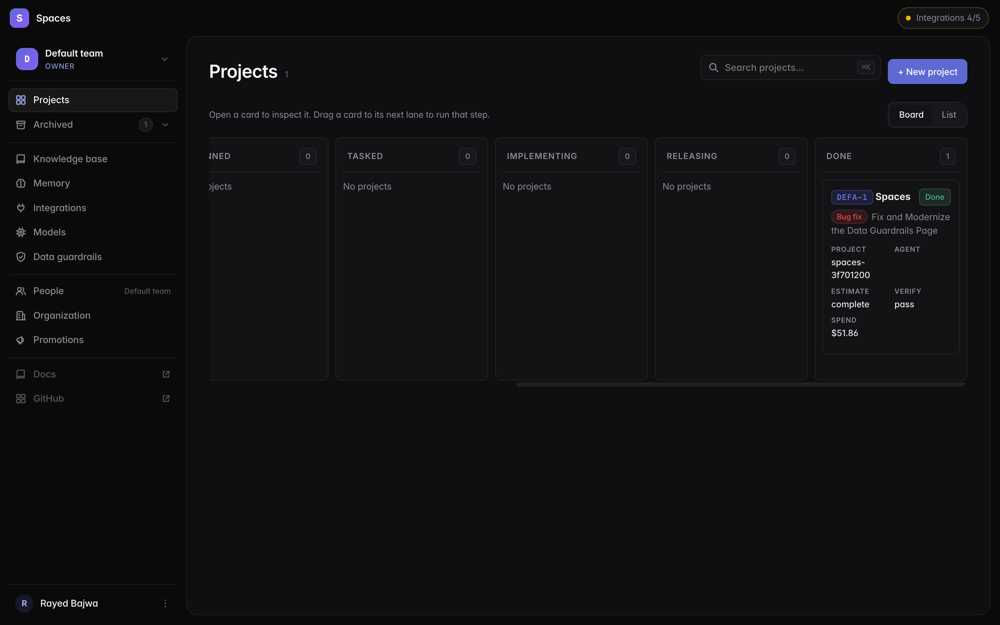
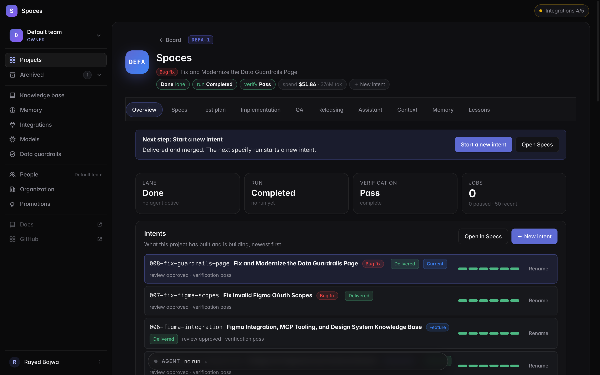
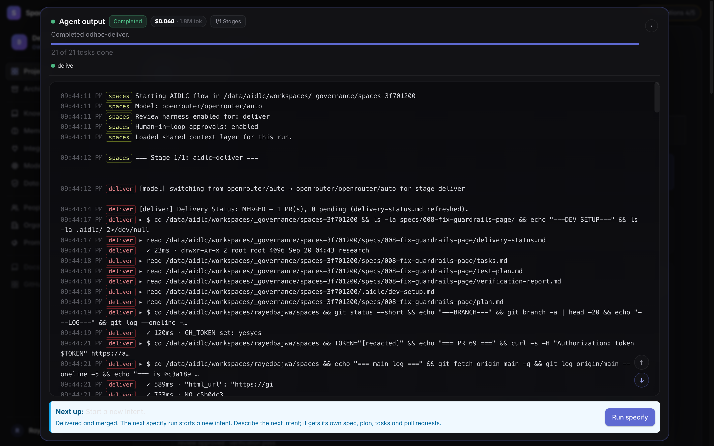
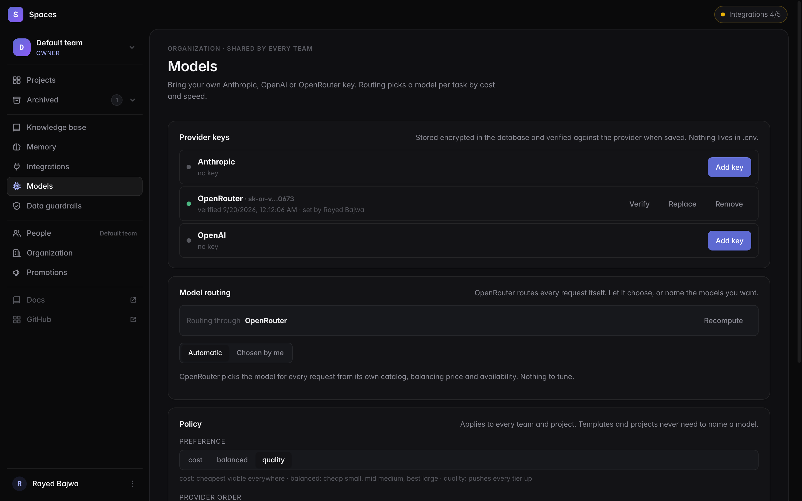
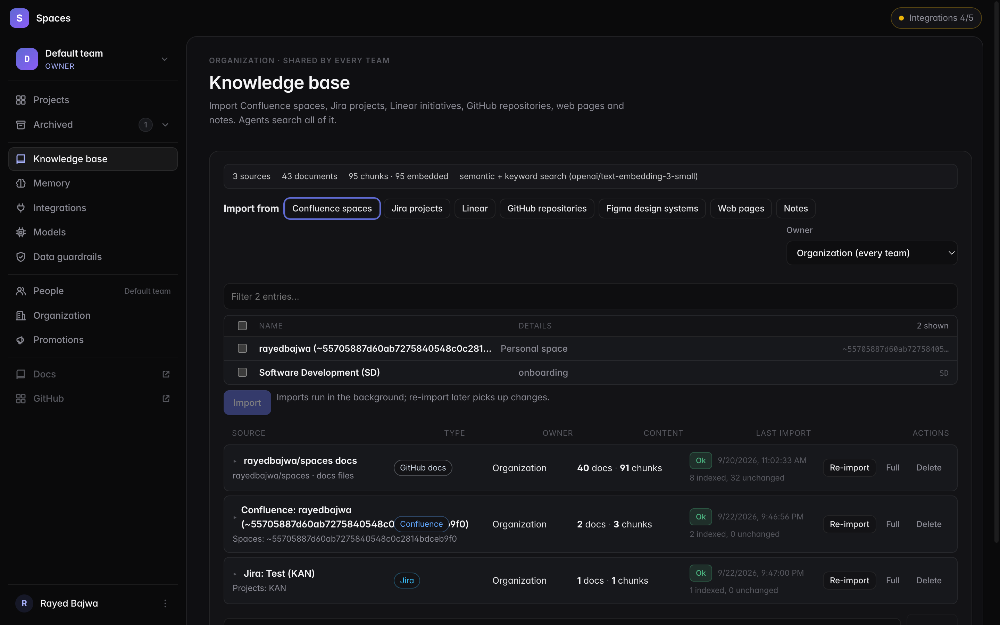
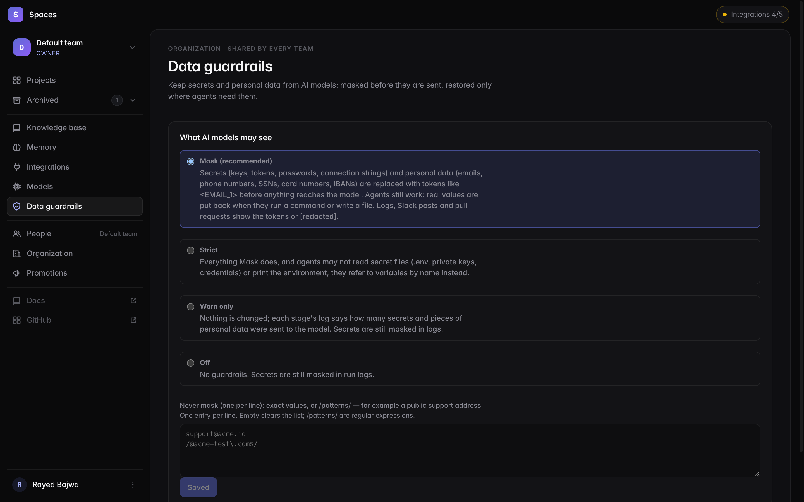
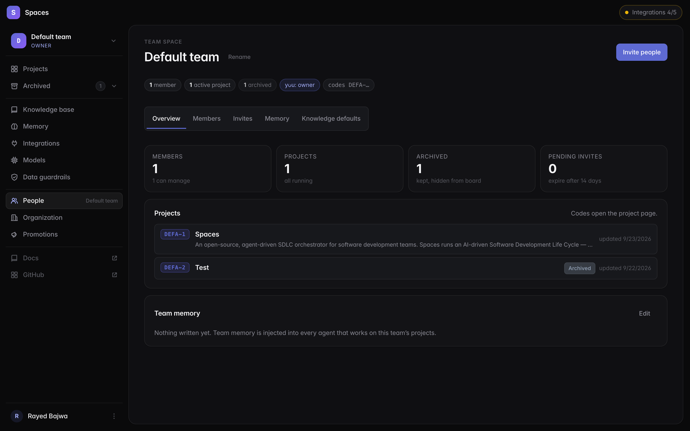
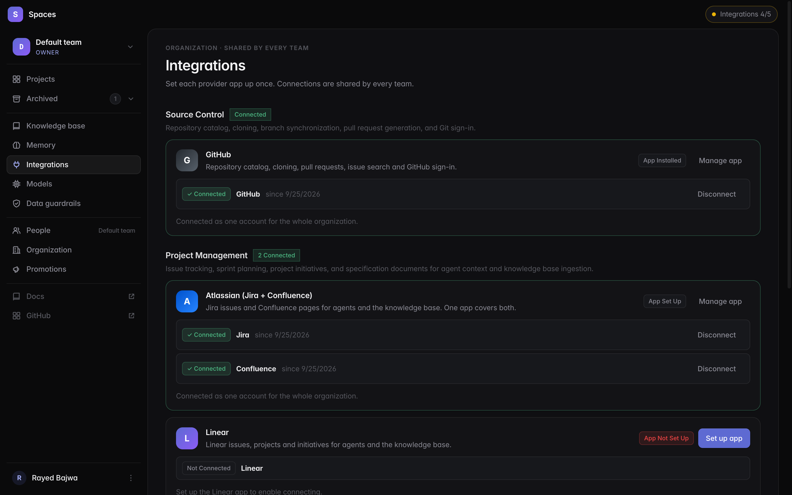
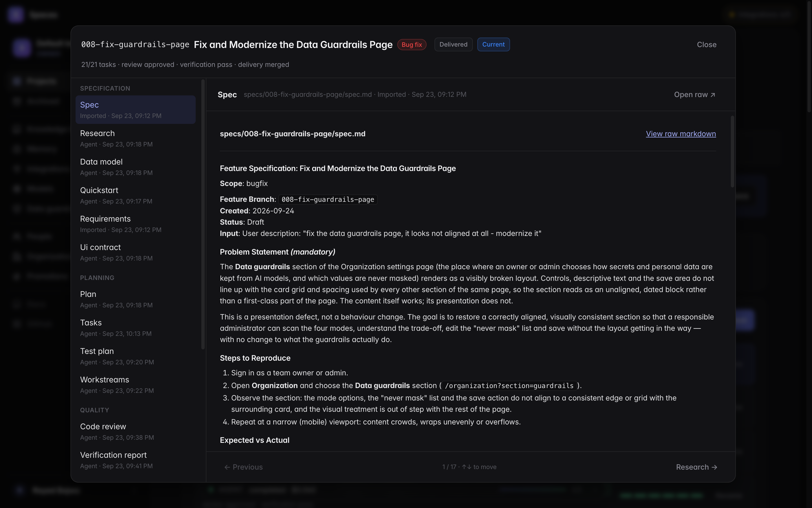

# Spaces

**A source-available, agent-driven SDLC orchestrator for software development teams.**

Spaces runs an AI-driven Software Development Life Cycle — `specify → plan →
tasks → implement → verify` — across a fleet of specialized agents, with a web
UI to inspect every step, human-in-the-loop review gates, and app-wide OAuth
integrations for GitHub, Jira, Confluence, and Slack.

Think of it as a project board where every card is powered by a persistent
agent that knows the codebase, your team's conventions, and the artifacts of
every previous stage.

Stages run on GitHub's [Spec Kit](https://github.com/github/spec-kit)
(through [`@the-agency/pi-spec-kit`](https://www.npmjs.com/package/@the-agency/pi-spec-kit),
with Spaces' own shorter skills and templates) and the
[Pi Coding Agent SDK](https://www.npmjs.com/package/@earendil-works/pi-coding-agent).
The pipeline follows the ideas of AWS's
[AI-Driven Development Life Cycle](https://github.com/awslabs/aidlc-workflows)
(AIDLC): inception and construction phases, role-based agents and human
approval gates. Spaces does not use the AIDLC workflow files themselves.

**Tags:** `agentic-workflows` · `aidlc` · `sdlc-automation` · `ai-development` ·
`llm-orchestration` · `pipeline-orchestrator` · `spec-kit` · `claude` ·
`developer-tools`

---

## Screenshots

### The board

Every project is a card with a readable code (`COMP-1`) on a kanban board whose
eight lanes derive from the artifacts each project has produced (the board
scrolls sideways when they do not fit). Running implement loops through code
review and QA on its own until both are nearly done; a feature whose review
approved it and whose verification passed (or was accepted) moves to
**Releasing** for delivery, and reaches **Done** only once delivery reports it
merged. Navigation lives in a sidebar: the team switcher at the
top, then Projects (with search, `⌘K`), the shared Knowledge base, Memory,
Integrations and Models, then People (team settings), Organization and
Promotions, and your account at the bottom. The top strip shows what needs
attention and the integration status; on small screens the sidebar folds
behind a menu button.



### Project page

Each project has its own page at `/spaces/<code>`: a hero with lane, run,
verification and repository chips, pill tabs, and an overview that opens with
stat tiles, the summary and repositories, the orchestrator and artifacts, and
the pause / archive / delete controls at the bottom. The live agent output is
a slim pill anchored at the bottom.



### Agent output

Open the pill and the agent output becomes a full-height sheet: stage
progress, the streamed log with scroll-to-top / bottom and smart following,
approval and clarification prompts that take the room when a human is
needed, and **Pause**, **Resume**, **Cancel** and **Retry** for the run.



### Models: automatic routing, keys in the app

No model is named anywhere. Provider keys (Anthropic, OpenAI, OpenRouter) are
entered here, stored encrypted and verified; for the provider in use the
catalog is scored by cost and speed into small / medium / large tiers, tuned by
a policy (cost / balanced / quality, provider order, premium models, pins).
With OpenRouter, OpenRouter routes each request.



### Organization knowledge base

Import Confluence spaces, Jira projects, Linear teams, projects and
initiatives, GitHub repository docs and issues, web pages and notes. Content
is chunked and indexed in Postgres (full-text plus pgvector embeddings); agents
search it with `org_knowledge_search`, the `research` stage loads it before
specifying, and every stage starts with the excerpts relevant to its project.



### Data guardrails

Choose what AI models may see, per organization: **Mask** (the default)
swaps secrets and personal data for tokens before anything reaches a model
and restores them only in the commands and files agents write; **Strict**
also keeps agents out of secret files; **Warn only** and **Off** relax it.
Values that should never be masked go in an allowlist.



### Team page

Members and roles, invite links, team memory and the knowledge defaults new
projects inherit, on a page of its own at `/teams/<slug>`.



### Self-serve integrations

Provider apps are set up once at the organization level, in the app. GitHub
is one click: Spaces creates a **GitHub App** for you through GitHub's
manifest flow and walks you through installing it; Slack opens a prefilled
*create app from manifest* page; Atlassian and Linear are guided through
their consoles. Credentials are stored encrypted. Nothing lives in `.env`.



### Every intent, browsable in-app

Every stage produces markdown artifacts (`spec.md`, `plan.md`, `tasks.md`,
`test-plan.md`, `verification-report.md`, etc.). Open an intent to page
through all of them, grouped by specification, planning and quality, with
its status and history.



---

## Who is this for?

- **Engineering leads** who want AI to run the boilerplate steps of feature
  delivery — spec, plan, tasks, tests — while keeping human review gates at the
  points that matter.
- **Solo developers** and **small teams** who want an agentic workflow that
  spans multiple projects, remembers prior context per project, and reuses
  warm agent sessions across runs.
- **Anyone experimenting with agentic SDLC patterns** who wants a real,
  runnable implementation of AIDLC-style, spec-driven delivery backed by
  Postgres, a job queue, and a project-board UI.

Spaces is **not** a code generator you fire and forget. It's a workflow
runtime that puts explicit review gates between stages and gives you the
inspectable artifacts each stage produces.

## Highlights

- **AIDLC pipeline templates** — declarative YAML DSL for stage/role/model/branch/retry
- **Research before specify** — a `research` stage suggests and clones the
  repositories a feature needs, learns them, loads the organization knowledge
  base and repository briefs, and writes a research brief the specification
  builds on
- **Per-project orchestrator + warm agent pool** — sub-agents dispatched per
  workstream; agent sessions are reused across runs for lower latency
- **Cross-model handoff memory** — the last few stages' key outputs are
  injected as a preamble so the next model has context even when you swap
  Sonnet → Opus → Haiku mid-pipeline
- **Repo-local changes** — each implementation repository gets
  `specs/<NNN-intent>/` (`change.yaml`, `tasks.md`, `spec.md`) committed with
  its code and PR, linked back to the initiative in the governing workspace by
  stable `github.com/org/repo` identifiers
- **Intents** — each piece of work (bug fix, feature, MVP, improvement,
  chore, spike, or Auto: the agent decides) is an intent whose statuses,
  documents and every change are recorded in Postgres, with the files as the
  agents' working copy; continue, rename or delete one, and open it to page
  through every artifact it produced and its history
- **Specs travel with the code** — implementation repositories get their
  repo-local change under the same numbered `specs/<intent>/` (e.g.
  `specs/003-search/`: `change.yaml`, the tasks they own, their delta spec) at every code stage, and their own pull request linked
  to the governing one; the rest of the intent's documents stay in Spaces
- **Data guardrails** — secrets and personal data become tokens before
  anything reaches a model and are restored only in the commands and files
  agents write; logs, Slack, pull requests and embeddings are masked too.
  Mask, Strict, Warn or Off per organization, with an allowlist
- **Agents never see Spaces' own secrets** — the application's database URL,
  encryption key and provider keys are unset in every agent shell, and the
  test suite refuses to run against a database that is not a test database
- **Logs you can follow** — a line per tool call (`▸ $ bun test …`,
  `✓ 2.1s · 12 pass`), stamped with the time and the agent's name, for stages
  and sub-agents alike
- **Cheaper long tests** — implement runs only the tests covering what
  changed; review and verify test only the intent's impacted area (the files it
  changed, listed for them), verify adds smoke/end-to-end tests for the affected
  flows and builds the image only when its inputs changed, and CI runs the full
  suite; each checkout has its own test
  database and port, package caches persist on the volume, commands are
  capped (default 20 minutes) and what a stage leaves running is stopped
- **Force kill** — a job idle for 10 minutes gets a Force kill in Recent jobs
  that cancels its run and kills the worker holding it
- **Human-in-the-loop review gates** after `specify`, `plan`, `tasks`,
  `testplan`, `implement`, `verify`
- **Live streaming output** in a bottom dock with stage progress, approvals,
  answers, and pause / resume / cancel for the run
- **Kanban board** with automatic lane derivation from artifact state, plus a
  page per project (`/spaces/COMP-1`) with a readable code derived from the
  team name
- **Project lifecycle** — pause (queued work waits, runs stop at the next
  stage boundary), archive (cancels work, hides the project, reversible) and
  a guarded permanent delete that requires the archived project's code
- **Organization and team pages** — memory, knowledge base, promotions,
  teams and integrations for the organization; members, invites, memory and
  knowledge defaults per team
- **Accounts, teams and invites** — email/password or GitHub sign-in; teams
  (AIDLC "spaces") own projects, memory and knowledge, with owner/admin/member/
  viewer roles and invite links; organization memory is shared by every team
- **Self-serve OAuth integrations** — GitHub, Jira, Confluence, Linear, Slack.
  App credentials are entered in the UI at the organization level and stored
  encrypted (AES-256-GCM) along with the tokens; nothing in `.env`
- **Per-project long-term memory** and automatic memory summaries
- **Organization knowledge base (RAG)** — import Confluence spaces, Jira and
  Linear projects and initiatives, GitHub repository docs and issues, web pages
  and notes; chunked and indexed in Postgres (full-text + pgvector embeddings),
  searched by agents through `org_knowledge_search` and fed into every stage's
  context. Works with OpenAI or OpenRouter embeddings; degrades to keyword
  search without them
- **Automatic model routing** — no model names anywhere: for the provider in
  use, the catalog is scored by cost and speed into small / medium / large
  tiers, tuned by an organization policy (cost / balanced / quality, provider
  order, premium models, pins); with OpenRouter, OpenRouter routes each request
- **Postgres-backed** job queue with per-project concurrency (SKIP LOCKED),
  stale-job reaper, and LISTEN/NOTIFY for reactive workers; a worker whose
  project has no work left hands its slot to a waiting project at once

---

## Documentation

See **[Model setup: bring your own key](#model-setup-bring-your-own-key-byok)** below for how model access works.

Full docs are published at **https://rayedbajwa.github.io/spaces/** (built from
`docs/` with MkDocs Material by the `Docs` workflow on every push to `main`).
Start with [Intents](docs/concepts/intents.md),
[Data guardrails](docs/concepts/data-guardrails.md) and
[Agents, workers & context](docs/concepts/agents-and-workers.md) for the
latest behaviour.

## Quickstart

Prerequisites: [Bun](https://bun.sh) 1.4+, Docker (for Postgres), an
Anthropic API key.

```bash
git clone https://github.com/<you>/spaces.git
cd spaces
cp .env.example .env
# Edit .env — set ENCRYPTION_KEY (openssl rand -base64 48); provider keys
#   and integrations are added in the app afterwards
bun install
bun run db:up
bun run db:migrate
bun run dev       # web UI on http://localhost:3000
bun run worker    # in a second terminal
```

Open [http://localhost:3000](http://localhost:3000), click **New project**,
walk through the 4-step wizard, and you'll have an AI-managed pipeline
running.

Or let the Makefile do it:

```bash
make setup        # .env with a fresh ENCRYPTION_KEY, bun install, Playwright Chromium, Postgres, schema, frontend
make up           # web server + supervisor in the background (.run/*.log)
make status       # processes, live workers, queue depth
make e2e          # bring the stack up and run the end-to-end suite for every pipeline
make e2e-one T=aidlc-express
make down
```

---

## Model setup: bring your own key (BYOK)

A key is required before the first project: **New project** is disabled and
`POST /api/projects` answers `409 no_provider_key` until one is stored.

Spaces does not come with model access and never names a model. You bring
the API keys of the providers you already pay for, and Spaces routes across
what those keys unlock.

**Providers.** Anthropic, OpenAI and OpenRouter. One is enough; with several,
the organization policy decides which one routes (OpenRouter is a good single
key: it fronts every vendor and routes each request itself).

**Supported providers and where to get a key**

| Provider | Get a key | Good for | Key looks like |
|---|---|---|---|
| **Anthropic** | [console.anthropic.com → API keys](https://console.anthropic.com/settings/keys) | Claude models directly; the pipeline's routing tables were designed around the haiku / sonnet / opus tiers | `sk-ant-…` |
| **OpenAI** | [platform.openai.com → API keys](https://platform.openai.com/api-keys) | GPT models directly; also serves the knowledge-base embeddings | `sk-…` / `sk-proj-…` |
| **OpenRouter** | [openrouter.ai → Keys](https://openrouter.ai/settings/keys) | One key for every vendor; OpenRouter routes each request itself (`openrouter/auto`) and also serves embeddings | `sk-or-…` |

Create the key in the provider's console (a project-scoped key with model
access is enough; no special permissions), then paste it here:


**Where keys go.** Sign in as a team owner or admin, open **Organization →
Models** and paste the key under **Provider keys**. It is verified against the
provider before it is saved (a rejected key is never stored), sealed with
AES-256-GCM using your `ENCRYPTION_KEY`, and shown masked afterwards. Nothing
about model access lives in `.env`; a key left there is ignored and named in
the boot log.

**What happens next.** Every process (web server, supervisor, per-project
workers) loads the stored keys at boot and again the moment one changes, so a
new or rotated key takes effect within a second without a restart. The same
keys serve agent runs, the knowledge base embeddings (OpenAI or OpenRouter)
and cross-stage compaction.

**Routing.** For the provider in use, Spaces reads the runtime's model catalog
(price per million tokens, context size, reasoning support), keeps the
current-generation chat models and fills three tiers:

| Tier | Used for | Balanced default |
|---|---|---|
| small | review, chat, fast mode | cheapest small model of the newest line |
| medium | planning, implementation | base model of the newest line |
| large | quality mode, retry escalation | most capable non-premium model |

The policy on the same page shifts this towards **cost** or **quality**,
orders providers, allows premium ("pro") models for the large tier, and can pin
a tier to an exact model. With OpenRouter first, every tier is
`openrouter/openrouter/auto`. Templates may still pin a model per step; a pin
from a provider without a key falls back to the same-size tier.

**Costs and limits.** Usage is billed by your provider to your account; Spaces
adds nothing. Verification calls are single cheap list requests. Rotating
`ENCRYPTION_KEY` means re-entering the keys, exactly as it does for
integration tokens.

## Architecture

```
┌─────────┐     SSE + HTTP     ┌──────────────┐
│ Browser │ ─────────────────► │  src/server  │  (Bun.serve)
└─────────┘                    └──────┬───────┘
                                      │
                                      ▼
                              ┌──────────────┐
                              │   Postgres   │  pipeline_runs, project_jobs,
                              │              │  app_integrations, artifacts…
                              └──────┬───────┘
                                     │  LISTEN/NOTIFY + 5s poll floor
                                     ▼
                              ┌──────────────┐
                              │  src/worker  │  claims jobs via SKIP LOCKED
                              └──────┬───────┘
                                     │
              ┌──────────────────────┼──────────────────────┐
              ▼                      ▼                      ▼
     ┌───────────────┐     ┌──────────────────┐    ┌─────────────────┐
     │  agent-pool   │     │  pipeline-engine │    │   dispatcher    │
     │ warm sessions │◄───►│  per-stage model │    │ per-project     │
     │ + reaper      │     │  + handoff memo  │    │ concurrency SQL │
     └───────┬───────┘     └────────┬─────────┘    └─────────────────┘
             │                      │
             └──────────┬───────────┘
                        ▼
              @earendil-works/pi-coding-agent (Pi SDK)
                        │
                        ▼
                    LLM provider
                    (Anthropic / OpenAI)
```

Key files:

- `src/server.ts` — Bun HTTP server, routes for projects/runs/orchestrator/oauth
- `src/worker.ts` — dispatcher loop that claims jobs and runs pipelines
- `src/lib/aidlc.ts` — thin wrapper around Pi SDK's `AIDLCFlow`
- `src/lib/pipeline-engine.ts` — pipeline template execution (per-stage models, handoff memory)
- `src/lib/dispatcher.ts` — job queue with per-project concurrency limits
- `src/lib/agent-pool.ts` — cross-run warm agent pool
- `src/lib/oauth.ts` — generic OAuth 2.0 flow, provider registry
- `src/lib/crypto-vault.ts` — AES-256-GCM sealing for stored tokens
- `data/pipelines/*.yml` — pipeline template DSL
- `data/personas/*.md` — persona system prompts
- `data/org/*` — shared org context injected into every run

---

## Configuring integrations

Each integration is optional. When configured, agents can pull context from
the connected system (issues, tickets, docs, messages) and integrations show
as connected dots in the hero.

Everything is self-serve from **Integrations** in the sidebar (the status
chip in the top strip opens a read-only summary). Press **Set up app** on a provider
card; an owner or admin of any team can do this, and the result is shared by
every team.

| Provider | How the app is set up |
|---|---|
| GitHub | **One click.** *Create GitHub App* sends GitHub an app manifest (name, callback URL, repository permissions); you confirm on GitHub and land back in Spaces with the app's client id, secret, private key and webhook secret stored. *Install on GitHub* then lets you pick the repositories, and the connection is approved on the way back. Optionally create the app under a GitHub organization. An existing OAuth App or GitHub App can be pasted in instead. |
| Slack | *Create Slack app* opens Slack's create-from-manifest page with the redirect URL and bot scopes filled in; paste the client id and secret from *Basic Information*. |
| Atlassian (Jira + Confluence) | Guided: open the developer console, create an OAuth 2.0 (3LO) app with the callback URL and scopes the card shows (copy buttons), paste the client id and secret. One app covers both. |
| Linear | Guided: create an OAuth application in Linear with the callback URL, paste the client id and secret. |

Then press **Connect** and approve. GitHub App user tokens expire after
eight hours and Atlassian tokens after one; Spaces refreshes them before use.

Nothing about integrations lives in `.env`.

Tokens are encrypted with `ENCRYPTION_KEY` and stored in the `app_integrations`
Postgres table. Rotating `ENCRYPTION_KEY` invalidates every stored token.

### GitHub-hosted repositories

Repos can be registered as local paths or as `owner/name` GitHub repos. With
GitHub connected, the new-project wizard autocompletes from the repos the
account can see. GitHub repos are cloned into `~/.aidlc/workspaces/<owner>/<name>`
(override with `AIDLC_WORKSPACE_ROOT`) as the **first** step of project
onboarding, and every run targets that clone. The token is passed to git as a
per-command header and never written into the clone.

### Governing workspace, repository catalog and long-term storage

Every new project gets a **governing workspace**: a local git repository
(`~/.aidlc/workspaces/_governance/<slug>`, override with
`AIDLC_GOVERNANCE_ROOT`, disable with `AIDLC_GOVERNANCE_WORKSPACE=0`) that is
the project's primary repo. It owns the Spec Kit workspace and every feature's
specs, plans, tasks and reports, plus exported project memory (`memory/`),
imported knowledge (`knowledge/`) and a `project.json` manifest. Exports are
committed after each stage pause/completion, so the workspace's git history on
local disk is the project's long-term store (push it to a remote of your
choosing if you want an off-machine copy).

No code repository has to be selected up front. When GitHub is connected, all
repositories the account can see are indexed into a **repository catalog**
(name, language, topics, README-derived use case; refreshed on connect and
every 6 hours) that is part of the shared context. The `plan` stage names the
repositories a feature touches from that catalog; after the plan completes,
unregistered ones are added to the project, cloned, learned and set up
automatically, so implementation runs in real checkouts.

### Reruns keep their context

Re-running or resuming a run from a stage reopens the previous attempt's agent
session (the same conversation, tool results and files read) and seeds the
cross-stage handoff thread from what earlier stages recorded, instead of
starting the worker from scratch.

### Suggested repositories and work areas

Onboarding ends by suggesting which repositories the project should span and
which work areas (services, modules, flows) the work will touch, using the
project description, the first feature and the synced GitHub catalog. The
suggestions are refreshed from `plan.md` after each plan stage. The project
overview shows them with reasons, confidence and role; unregistered repos get
an **Add & clone** button, work areas list the repos, likely paths and risks,
and **refresh** regenerates them (`POST /api/projects/:id/suggestions`).

### Repositories a feature depends on

The `plan` stage writes a `## Repositories` section in `plan.md` naming every
repository the feature changes (using the project's repository map) and
flags any it needs that is `(not registered)`. The project overview compares
that list with the registered repos: missing GitHub repos get an **Add &
clone** button, others an add form, and registered repos can be edited,
re-cloned or made primary. Workstreams then run in the right checkout via
their `### Repository` field.

### Project onboarding

Creating a project runs an onboarding job the wizard waits on: clone remote
repos → initialize the Spec Kit `.specify/` workspace in the primary repo →
inventory every repo (stack, layout, scripts) → a read-only agent writes a
project brief per repo → the result is stored as the project's auto-summary
memory and fed to every later stage. Multi-repo projects get a repository map
so plans and workstreams can name the repo they touch.

### A browser for implement and QA agents

Every stage session has browser tools backed by headless Chromium
(Playwright): `browser_open`, `browser_act` (click, type, press, select,
wait), `browser_read` (text, HTML, URL, JavaScript eval, diagnostics),
`browser_screenshot` and `browser_close`. Agents are instructed not to stop
at unit tests for anything a user sees: start the app with `bash`, verify the
flow in the browser, and cite screenshots (saved under `.aidlc/qa/` in the
checkout) in verification and QA reports. Console errors and failed requests
are surfaced with every read. The `playwright-browser` skill from the
[pi-playwright](https://pi.dev/packages/pi-playwright) package is loaded into
every session as well, for a CLI-first workflow (`pw.js open / snapshot /
click / fill / screenshot`, saved auth state, console and network logs).
Chromium comes from `playwright install chromium`, run by `make setup` and
baked into the Docker image.

### Integrations as knowledge

Connected Jira, Confluence, Linear and GitHub are exposed to agents as two
tools, `integration_search(source, query)` and `integration_get(source, id)`,
plus a "Knowledge Sources" note in the shared context that tells agents to
fetch referenced tickets/docs rather than guess. Per project, the **Context**
tab lets you choose which sources and repos are in scope and narrow them
(Jira project keys, Linear teams/projects, Confluence spaces, GitHub repos);
agents only see what you selected. The wizard's **Import from Jira / Linear**
pulls a ticket into the project as a source snapshot and pre-fills the first
feature.

[pi-knowledge](https://pi.dev/packages/pi-knowledge) (`pi install npm:pi-knowledge`)
is complementary: it adds local semantic search over files, PDFs and URLs. The
tool names here were chosen not to collide with it.

### Dev-environment setup before code stages

Every registered repository — primary and secondary — is set up, first during
onboarding and again whenever a repo is added or its setup record is stale.
Before `implement`, `orchestrate` and `verify` (and before parallel
sub-agents run in a checkout), an agent reviews the README, CONTRIBUTING,
manifests and CI config, installs dependencies, prepares `.env` from its
example with safe defaults, runs the build, tests and linter once, and records
the working commands and test baseline in `.aidlc/dev-setup.md` (local-only,
excluded via `.git/info/exclude`). Later stages read that file for the exact
commands; the step is skipped while a READY/PARTIAL record under a week old
exists.

### Delivery: review → merge → deploy → UAT

The `tasks` stage ends with a "## Delivery" group per repository in dependency
order, and the new `deliver` stage drives it. Before the stage runs, the
pipeline refreshes `delivery-status.md` from GitHub: every PR the feature
opened, its review, CI, merge and deployment state, ordered by stack. The
agent then fixes what blocks a PR itself (rebase, CI, review comments, missing
PRs), asks for approval with a `## Question` and pauses before merging or
deploying, confirms deployments, runs the UAT scenarios from `test-plan.md`
against the deployed environment, and writes `delivery-report.md` with a
`Delivery Status: MERGED | PARTIAL | BLOCKED` line. Templates can loop
`deliver` on `delivery_status != 'MERGED'` after the human gate to keep
polling until everything is merged.

Agents in general are directed to act rather than advise: fix lint, tests,
dependencies and CI themselves and re-check, asking for approval only before
irreversible or costly actions. The project assistant follows the same rule
and can open PRs, rerun or approve runs and run steps once you say yes.

### Who pushes and who approves

When GitHub is set up as a GitHub App (the one-click flow), agents push
branches, open pull requests, comment and merge **as the app bot**
(`<app>[bot]`) using short-lived installation tokens, while reads such as
the repository catalog still use the connected user. Pull requests therefore
have a bot author, so a human can approve them and branch protection applies
to the agent. Recommended protection on `main`: require a pull request with
one approval, require the CI checks, dismiss stale reviews, no force pushes.
Leave "include administrators" off so the repository owner keeps direct
access; the bot is never an administrator. With a classic OAuth App the agent
acts as the connected user instead, and GitHub will not let that user approve
their own pull requests.

### Tokens and cost

Every model call a run makes is recorded with its tokens (input, output,
cache reads and writes) and cost from the model's price table. Costs show
live in the agent output bar, on the board card, in the project hero and in a
*Tokens & cost* panel on the project overview (by stage, by model, by run);
the organization overview shows spend for the last 30 days and by project.
`GET /api/projects/:slug/usage` and `GET /api/org/usage` expose the numbers.

Prompts are kept small: Spaces' own, shorter Spec Kit skills and templates
(`data/speckit/`); the shared context sent once per agent session, in its
system prompt; each stage reads only the intent's files it needs, told to it by
path; and hand-off summaries only where a session has not seen the earlier
stages. `bun run e2e` reports each template's tokens and cost per stage, and
`E2E_BASELINE=<earlier .json>` compares two runs.

### Implementation harness: tasks → PR + CI → code review → QA

In the feature template the code stages form a loop: `implement` executes the
tasks and opens or updates the PR (Conventional Commits title); the new
`review` stage refreshes CI state from GitHub, reviews the diff against the
spec, plan and test plan, runs lint/tests itself, writes `code-review.md`
(`Code Review Status: APPROVED | CHANGES_REQUESTED`, findings with severity
and file:line) and posts it as a comment on the PR. `CHANGES_REQUESTED` loops
back to `implement`, which must address every blocker/major finding before
continuing; `APPROVED` proceeds to `verify` (QA) and then `deliver`. Every
commit and PR title the pipeline writes follows Conventional Commits
(`type(scope): subject`).

### Pull requests

When the target repo is GitHub-hosted, the `implement`, `orchestrate` and
`verify` stages commit the feature branch, push it and open or update a pull
request against the default branch (verify adds a comment with the
verification status). Parallel workstreams each run in an isolated git
worktree on their own branch and get their own PR; a workstream whose
`### Dependencies` names another workstream is branched from that workstream's
branch and its PR targets it — a stacked PR — and workstreams run in
dependency order.

### Workers: shared or one per project

`bun run src/worker.ts` starts one shared worker that runs jobs from different
projects concurrently (`WORKER_MAX_CONCURRENT_JOBS`, default 4) while still
honouring each project's `max_concurrent`.

`bun run src/supervisor.ts` scales instead: it watches the job queue and spawns
a dedicated worker for every project that has work, each claiming only its own
project's jobs. A worker is **hot** while running jobs, **warm** while alive but
idle (it keeps paused runs' engines in memory), and exits after
`WORKER_IDLE_EXIT_SECONDS` (default 300) of idleness; the supervisor respawns it
the moment new work appears. `SUPERVISOR_MAX_WORKERS` (default 4) caps the
fleet; each worker is a Bun process holding live agent sessions, roughly
300–500 MB, so size the cap to the host's memory. Workers
heartbeat into the `workers` table, which drives the worker indicator in the
project overview and lets the server detect a dead owner when routing answers.

### Runs that fail or get interrupted

A worker restart no longer marks in-flight runs as failed: running runs are
re-queued from the interrupted stage and paused runs stay paused (answering
restarts the stage on a new worker). Transient provider errors (socket closed,
5xx, overloaded) retry from the same stage automatically. Any failed or
finished run can be re-run from the stage it stopped at, or from the start,
with `POST /api/runs/:id/rerun` or the buttons in the run panel.

---

## Authoring pipeline templates

Templates in `data/pipelines/*.yml` describe the stages, personas, and gates
of a pipeline. A minimal example:

```yaml
name: my-mvp
description: Fast MVP pipeline
stages:
  - id: specify
    role: architect
    model: claude-sonnet-4-5
  - id: plan
    role: architect
    model: claude-sonnet-4-5
    thinking: extended
  - id: tasks
    role: developer
    model: claude-haiku-4-5
  - id: implement
    role: developer
    model: claude-sonnet-4-5
    branch:
      onComplete: verify
  - id: verify
    role: qa
    model: claude-sonnet-4-5
    maxIterations: 3
```

See the shipped templates (`aidlc-mvp.yml`, `aidlc-feature.yml`,
`aidlc-enterprise.yml`) for full-featured examples with branching, retry, and
per-stage model selection.

---

## Deployment note

Spaces runs locally by default. Sign-in is on (first account is owner,
others join by invite), but agents execute code and hold repository tokens,
so treat a hosted instance as a small, trusted deployment.

**Railway** is the quickest hosted setup: deploy the repository as one
service (the shipped `railway.json` builds the `Dockerfile` and starts
`bun run src/standalone.ts`, which runs the web server and the supervisor
together so they share one `/data` volume), add a Postgres database and a
volume mounted at `/data`, set `DATABASE_URL` and `ENCRYPTION_KEY`. Behind
Railway's TLS proxy the app derives its public `https://` origin from the
forwarded headers (or `PUBLIC_URL`), so OAuth callbacks and the GitHub App
manifest just work.

See [SECURITY.md](SECURITY.md) for the caveats before deploying, and the
[cloud deployment guide](https://rayedbajwa.github.io/spaces/operations/cloud-deployment/)
for Railway step by step, Docker Compose, managed containers
(ECS/Cloud Run/Container Apps), Kubernetes, and Fly/Render.
The shipped image includes git and stores repos, governing workspaces and agent
sessions under a `/data` volume. For production use an **external, dedicated
Postgres 16** (managed service or HA cluster) and
`docker compose -f docker-compose.prod.yml up -d --build`, which runs only the
app and the supervisor; the Postgres container in `docker-compose.yml` is for
local development.

---

## Contributing

PRs welcome. See [CONTRIBUTING.md](CONTRIBUTING.md) for setup, conventions,
and areas where contributions are especially useful.

`bun test` only writes to a test database: `TEST_DATABASE_URL` when set, else a
local `DATABASE_URL` or one named for tests (`test`, `agent`, `ci`). Anything
else makes the database suites skip (see
[Configuration](docs/reference/configuration.md#running-the-test-suite)).

---

## License

Personal, non-commercial use only; no redistribution. See [LICENSE](LICENSE).
