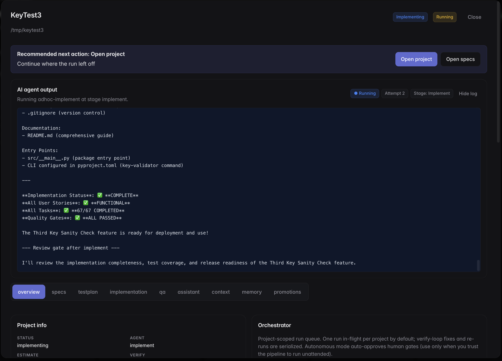

# Spaces

**An open-source, agent-driven SDLC orchestrator for software development teams.**

Spaces runs an AI-driven Software Development Life Cycle — `specify → plan →
tasks → implement → verify` — across a fleet of specialized agents, with a web
UI to inspect every step, human-in-the-loop review gates, and app-wide OAuth
integrations for GitHub, Jira, Confluence, and Slack.

Think of it as a project board where every card is powered by a persistent
agent that knows the codebase, your team's conventions, and the artifacts of
every previous stage.

Built on the [AIDLC framework](https://github.com/awslabs/aidlc-workflows)
(AI-Driven Development Life Cycle) and the
[Pi Coding Agent SDK](https://www.npmjs.com/package/@earendil-works/pi-coding-agent).

**Tags:** `agentic-workflows` · `aidlc` · `sdlc-automation` · `ai-development` ·
`llm-orchestration` · `pipeline-orchestrator` · `spec-kit` · `claude` ·
`developer-tools`

---

## Screenshots

### Project detail — pipeline running

Every project opens into a detail modal showing the AI agent output live, plus
tabs for specs, tests, implementation, QA, chat, context, memory, and
promotions. The orchestrator panel on the right controls autonomous mode and
per-project concurrency.



### Generated artifacts, browsable in-app

Every stage produces markdown artifacts (`spec.md`, `plan.md`, `tasks.md`,
`test-plan.md`, `verification-report.md`, etc.) that render inline in the app.
Below is a spec.md generated by the `specify` stage for a "Third Key Sanity
Check" feature.


---

## Who is this for?

- **Engineering leads** who want AI to run the boilerplate steps of feature
  delivery — spec, plan, tasks, tests — while keeping human review gates at the
  points that matter.
- **Solo developers** and **small teams** who want an agentic workflow that
  spans multiple projects, remembers prior context per project, and reuses
  warm agent sessions across runs.
- **Anyone experimenting with agentic SDLC patterns** who wants a real,
  runnable reference implementation of the AIDLC framework backed by
  Postgres, a job queue, and a project-board UI.

Spaces is **not** a code generator you fire and forget. It's a workflow
runtime that puts explicit review gates between stages and gives you the
inspectable artifacts each stage produces.

## Highlights

- **AIDLC pipeline templates** — declarative YAML DSL for stage/role/model/branch/retry
- **Per-project orchestrator + warm agent pool** — sub-agents dispatched per
  workstream; agent sessions are reused across runs for lower latency
- **Cross-model handoff memory** — the last few stages' key outputs are
  injected as a preamble so the next model has context even when you swap
  Sonnet → Opus → Haiku mid-pipeline
- **Human-in-the-loop review gates** after `specify`, `plan`, `tasks`,
  `testplan`, `implement`, `verify`
- **Live streaming output** in the browser over SSE
- **Kanban board** with automatic lane derivation from artifact state
- **App-wide OAuth integrations** — GitHub, Jira, Confluence, Slack. Tokens
  encrypted at rest (AES-256-GCM)
- **Per-project long-term memory** and automatic memory summaries
- **Postgres-backed** job queue with per-project concurrency (SKIP LOCKED),
  stale-job reaper, and LISTEN/NOTIFY for reactive workers

---

## Quickstart

Prerequisites: [Bun](https://bun.sh) 1.4+, Docker (for Postgres), an
Anthropic API key.

```bash
git clone https://github.com/<you>/spaces.git
cd spaces
cp .env.example .env
# Edit .env — set ENCRYPTION_KEY (openssl rand -base64 48) + ANTHROPIC_API_KEY
bun install
bun run db:up
bun run db:migrate
bun run dev       # web UI on http://localhost:3000
bun run worker    # in a second terminal
```

Open [http://localhost:3000](http://localhost:3000), click **New project**,
walk through the 4-step wizard, and you'll have an AI-managed pipeline
running.

---

## Architecture

```
┌─────────┐     SSE + HTTP     ┌──────────────┐
│ Browser │ ─────────────────► │  src/server  │  (Bun.serve)
└─────────┘                    └──────┬───────┘
                                      │
                                      ▼
                              ┌──────────────┐
                              │   Postgres   │  pipeline_runs, project_jobs,
                              │              │  app_integrations, artifacts…
                              └──────┬───────┘
                                     │  LISTEN/NOTIFY + 5s poll floor
                                     ▼
                              ┌──────────────┐
                              │  src/worker  │  claims jobs via SKIP LOCKED
                              └──────┬───────┘
                                     │
              ┌──────────────────────┼──────────────────────┐
              ▼                      ▼                      ▼
     ┌───────────────┐     ┌──────────────────┐    ┌─────────────────┐
     │  agent-pool   │     │  pipeline-engine │    │   dispatcher    │
     │ warm sessions │◄───►│  per-stage model │    │ per-project     │
     │ + reaper      │     │  + handoff memo  │    │ concurrency SQL │
     └───────┬───────┘     └────────┬─────────┘    └─────────────────┘
             │                      │
             └──────────┬───────────┘
                        ▼
              @earendil-works/pi-coding-agent (Pi SDK)
                        │
                        ▼
                    LLM provider
                    (Anthropic / OpenAI)
```

Key files:

- `src/server.ts` — Bun HTTP server, routes for projects/runs/orchestrator/oauth
- `src/worker.ts` — dispatcher loop that claims jobs and runs pipelines
- `src/lib/aidlc.ts` — thin wrapper around Pi SDK's `AIDLCFlow`
- `src/lib/pipeline-engine.ts` — pipeline template execution (per-stage models, handoff memory)
- `src/lib/dispatcher.ts` — job queue with per-project concurrency limits
- `src/lib/agent-pool.ts` — cross-run warm agent pool
- `src/lib/oauth.ts` — generic OAuth 2.0 flow, provider registry
- `src/lib/crypto-vault.ts` — AES-256-GCM sealing for stored tokens
- `data/pipelines/*.yml` — pipeline template DSL
- `data/personas/*.md` — persona system prompts
- `data/org/*` — shared org context injected into every run

---

## Configuring integrations

Each integration is optional. When configured, agents can pull context from
the connected system (issues, tickets, docs, messages) and integrations show
as connected dots in the hero.

For each provider you want to enable:

1. Register an OAuth app with the provider.
2. Set the callback URL to `http://<host>:<port>/api/oauth/<provider>/callback`.
   - GitHub uses `github`
   - Jira **and** Confluence share the `atlassian` provider
   - Slack uses `slack`
   - Linear uses `linear`
3. Paste `CLIENT_ID` + `CLIENT_SECRET` into `.env` (see `.env.example` for the
   exact variable names).
4. Restart the server.
5. In the web UI, click the **Integrations** chip in the hero and press
   **Connect** for each provider.

Tokens are encrypted with `ENCRYPTION_KEY` and stored in the `app_integrations`
Postgres table. Rotating `ENCRYPTION_KEY` invalidates every stored token.

### GitHub-hosted repositories

Repos can be registered as local paths or as `owner/name` GitHub repos. With
GitHub connected, the new-project wizard autocompletes from the repos the
account can see. GitHub repos are cloned into `~/.aidlc/workspaces/<owner>/<name>`
(override with `AIDLC_WORKSPACE_ROOT`) as the **first** step of project
onboarding, and every run targets that clone. The token is passed to git as a
per-command header and never written into the clone.

### Project onboarding

Creating a project runs an onboarding job the wizard waits on: clone remote
repos → initialize the Spec Kit `.specify/` workspace in the primary repo →
inventory every repo (stack, layout, scripts) → a read-only agent writes a
project brief per repo → the result is stored as the project's auto-summary
memory and fed to every later stage. Multi-repo projects get a repository map
so plans and workstreams can name the repo they touch.

### Integrations as knowledge

Connected Jira, Confluence, Linear and GitHub are exposed to agents as two
tools, `integration_search(source, query)` and `integration_get(source, id)`,
plus a "Knowledge Sources" note in the shared context that tells agents to
fetch referenced tickets/docs rather than guess. Per project, the **Context**
tab lets you choose which sources and repos are in scope and narrow them
(Jira project keys, Linear teams/projects, Confluence spaces, GitHub repos);
agents only see what you selected. The wizard's **Import from Jira / Linear**
pulls a ticket into the project as a source snapshot and pre-fills the first
feature.

[pi-knowledge](https://pi.dev/packages/pi-knowledge) (`pi install npm:pi-knowledge`)
is complementary: it adds local semantic search over files, PDFs and URLs. The
tool names here were chosen not to collide with it.

### Pull requests

When the target repo is GitHub-hosted, the `implement`, `orchestrate` and
`verify` stages commit the feature branch, push it and open or update a pull
request against the default branch (verify adds a comment with the
verification status). Parallel workstreams each run in an isolated git
worktree on their own branch and get their own PR; a workstream whose
`### Dependencies` names another workstream is branched from that workstream's
branch and its PR targets it — a stacked PR — and workstreams run in
dependency order.

### Workers: shared or one per project

`bun run src/worker.ts` starts one shared worker that runs jobs from different
projects concurrently (`WORKER_MAX_CONCURRENT_JOBS`, default 4) while still
honouring each project's `max_concurrent`.

`bun run src/supervisor.ts` scales instead: it watches the job queue and spawns
a dedicated worker for every project that has work, each claiming only its own
project's jobs. A worker is **hot** while running jobs, **warm** while alive but
idle (it keeps paused runs' engines in memory), and exits after
`WORKER_IDLE_EXIT_SECONDS` (default 300) of idleness; the supervisor respawns it
the moment new work appears. `SUPERVISOR_MAX_WORKERS` caps the fleet. Workers
heartbeat into the `workers` table, which drives the worker indicator in the
project overview and lets the server detect a dead owner when routing answers.

### Runs that fail or get interrupted

A worker restart no longer marks in-flight runs as failed: running runs are
re-queued from the interrupted stage and paused runs stay paused (answering
restarts the stage on a new worker). Transient provider errors (socket closed,
5xx, overloaded) retry from the same stage automatically. Any failed or
finished run can be re-run from the stage it stopped at, or from the start,
with `POST /api/runs/:id/rerun` or the buttons in the run panel.

---

## Authoring pipeline templates

Templates in `data/pipelines/*.yml` describe the stages, personas, and gates
of a pipeline. A minimal example:

```yaml
name: my-mvp
description: Fast MVP pipeline
stages:
  - id: specify
    role: architect
    model: claude-sonnet-4-5
  - id: plan
    role: architect
    model: claude-sonnet-4-5
    thinking: extended
  - id: tasks
    role: developer
    model: claude-haiku-4-5
  - id: implement
    role: developer
    model: claude-sonnet-4-5
    branch:
      onComplete: verify
  - id: verify
    role: qa
    model: claude-sonnet-4-5
    maxIterations: 3
```

See the shipped templates (`aidlc-mvp.yml`, `aidlc-feature.yml`,
`aidlc-enterprise.yml`) for full-featured examples with branching, retry, and
per-stage model selection.

---

## Deployment note

Spaces is designed for **local, single-user development** by default. There
is no built-in authentication on the web UI. **Do not expose it to the
public internet** without putting an authenticating reverse proxy in front
(Cloudflare Access, Tailscale, Caddy basic-auth, etc.).

See [SECURITY.md](SECURITY.md) for the full list of caveats before deploying.

---

## Contributing

PRs welcome. See [CONTRIBUTING.md](CONTRIBUTING.md) for setup, conventions,
and areas where contributions are especially useful.

---

## License

[MIT](LICENSE)
