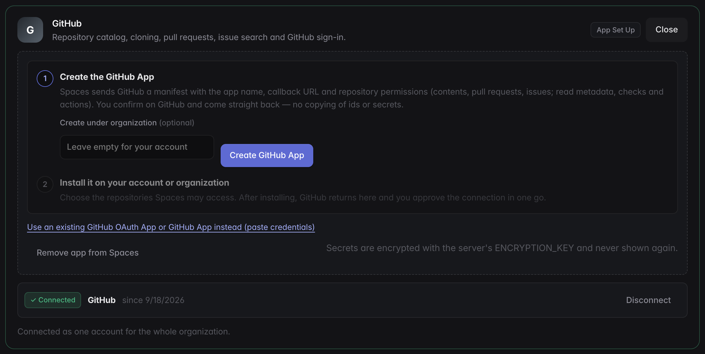

# Integrations as knowledge

Integrations are connected once, app-wide, through OAuth. Tokens are sealed
with AES-256-GCM using `ENCRYPTION_KEY` and stored in Postgres.

| Provider | OAuth provider id | What agents get |
|---|---|---|
| GitHub | `github` | Repository catalog, cloning, PRs, issue/PR search |
| Jira | `atlassian` (shared with Confluence) | Issue search (JQL or text) and full issues with comments |
| Confluence | `atlassian` | Page search (CQL or text) and page content |
| Linear | `linear` | Issue search and full issues with comments |
| Slack | `slack` | A channel per project with run updates, stage summaries and approval requests |

Setup is self-serve under **Organization → Integrations**: press **Set up
app** on a provider card, then **Connect**. Apps are organization-wide and
required before a provider can be connected; nothing about integrations is
read from `.env`.

| Provider | Setup |
|---|---|
| GitHub | One click. Spaces posts a [GitHub App manifest](https://docs.github.com/en/apps/sharing-github-apps/registering-a-github-app-from-a-manifest) (name, callback URL, repository permissions: contents, pull requests and issues write; metadata, checks and actions read; no webhook). You confirm on GitHub, and Spaces exchanges the returned code for the app's client id, secret, private key and webhook secret, all stored encrypted. **Install on GitHub** picks the repositories; GitHub then returns to Spaces, which starts the ordinary authorize flow and stores the user token. The app can be created under a GitHub organization; a pre-existing OAuth App or GitHub App can be pasted in instead. |
| Slack | **Create Slack app** opens Slack's create-from-manifest page prefilled with the redirect URL and bot scopes; the client id and secret are pasted from *Basic Information*. |
| Atlassian | Guided through the developer console: create an OAuth 2.0 (3LO) app, add the callback URL and enable the listed scopes (copy buttons), paste the client id and secret. |
| Linear | Guided through Linear's OAuth applications page: add the callback URL, paste the client id and secret. |

Access tokens that expire (GitHub App user tokens after eight hours,
Atlassian after one hour) are refreshed automatically before use through the
provider's refresh token, and the new token is stored for every integration
kind that shares it.

!!! note "Reconnect needed"
    If the stored token can no longer be decrypted (for example the
    `ENCRYPTION_KEY` changed, or a process with a different key re-saved it),
    the panel shows **⚠ reconnect needed** instead of *connected*, and token
    lookups fail with a message naming that cause.

## Slack channels per project

With Slack connected, every project gets a public channel, `#spaces-<code>`
(for example `#spaces-defa-1`). The channel is created when Slack is connected
(for every existing project), when a project is created, or at its first
post. An existing channel with that name is joined rather than duplicated. The
project's team members are invited when Slack knows their email.

Runs post there:

| When | Message |
|---|---|
| A run starts | The pipeline and its stages |
| A stage finishes | Its summary (the compacted handoff the next stage receives) |
| Approval is needed | `@here`, the summary of the stage to decide on, and an **Open in Spaces** button |
| The agent asks a question | `@here`, the question, and the button |
| The run finishes or fails | The outcome, and the error for a failure |

Approving and answering happen in Spaces; the button links to the project
(`PUBLIC_URL/spaces/<code>`). A channel deleted or archived in Slack is
replaced at the next post. Slack errors never fail a run; a missing permission
is logged once per organization.

The bot needs `channels:manage`, `channels:read`, `channels:join`,
`chat:write`, `users:read` and `users:read.email`. The **Create Slack app**
manifest includes them. A Slack app created before these were added needs
the scopes added under *OAuth & Permissions*, then Slack reconnected under
Organization → Integrations.
## Agent tools

Connected sources are exposed to every agent session as two tools:

- `integration_search(source, query)` — free text, an exact key (`PROJ-123`,
  `ENG-45`, `owner/name#12`), or a native query (JQL, CQL, GitHub search).
- `integration_get(source, id)` — the full item: description, status, comments.

The shared context carries a *Knowledge Sources* note telling agents to fetch
referenced tickets and docs rather than guess, to be efficient (one targeted
search, then one to three items in full) and to cite ids in artifacts.

## Per-project scope

In the project's **Context** tab you choose which connected sources the
project may use and narrow them: Jira project keys, Linear teams and projects,
Confluence spaces, GitHub repositories. Agents only see the selected sources,
and their queries are filtered accordingly.

## Importing tickets

The new-project wizard's **Import from Jira / Linear** searches a source, pulls
a ticket in as the name, description and first feature, and attaches it to the
project as a *source snapshot* that appears in every stage's context.
`POST /api/projects/:id/sources/import` does the same for existing projects.

## Organization knowledge base (RAG)

Beyond on-demand lookups, whole bodies of knowledge can be **imported** into a
searchable knowledge base from **Organization memory & knowledge** in the user
menu:

| Import | Picks from | What is indexed |
|---|---|---|
| Confluence | spaces | every page of the space |
| Jira | projects (or a JQL filter) | issues with description and comments |
| Linear | teams, projects, initiatives | initiative and project descriptions, then their issues with comments |
| GitHub | repositories | documentation files (`*.md`, `*.rst`, `*.txt`, … or your own include patterns) on a branch, or issues and pull requests |
| Web pages | URLs | the page text |
| Notes | — | free text typed or pasted in |

Each import is a **source** owned by the organization (visible to every team)
or by one team. Importing runs inside the server; re-import is incremental
(only pages, issues or files changed since the last import are re-read) and a
*full re-import* re-enumerates the source and prunes items that disappeared.

Documents are split into heading-aware chunks and indexed twice: a Postgres
full-text index, and a pgvector embedding (`EMBEDDING_MODEL`) when an
embedding key is configured. Search fuses both rankings, so results degrade
gracefully to keyword search without embeddings or without the `vector`
extension.

Agents get the base in two ways: every stage's shared context starts with the
excerpts most relevant to the project and current feature, and the
`org_knowledge_search(query)` tool answers ad-hoc questions with cited
excerpts. The panel has a search box to try queries yourself.

API: `GET /api/org/knowledge/catalog?integration=…` lists what can be
imported, `POST /api/org/knowledge/sources` creates and imports a source,
`POST /api/org/knowledge/sources/:id/import` re-imports (`{"full": true}` to
re-enumerate), `POST /api/org/knowledge/notes` adds a note, and
`GET /api/org/knowledge/search?q=…` searches.

## Repository catalog

With GitHub connected, every visible repository is indexed with its
README-derived use case into a catalog that the plan stage and onboarding use
to name repositories. It refreshes on connect and every six hours
(`POST /api/github/catalog/sync` forces it).

## pi-knowledge

[pi-knowledge](https://pi.dev/packages/pi-knowledge) adds local semantic search
over files, PDFs and URLs and complements the integration tools; our tool names
were chosen not to collide with it.
