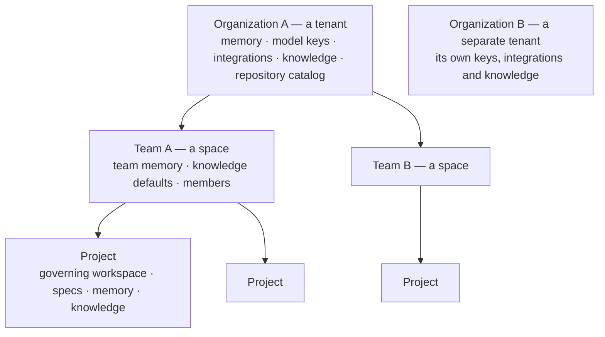

# Organizations, teams and access

Spaces follows the AIDLC model of **spaces**. An **organization is the tenant
boundary**: one installation can host many organizations, and two of them share
nothing. Inside an organization, teams each own their projects, memory and
knowledge, so several teams can work side by side without colliding.

| Layer | Shared with | Holds |
|---|---|---|
| **Organization** (tenant) | its own teams only | Organization memory, LLM provider keys, model routing policy, OAuth apps and integrations, knowledge sources, the GitHub repository catalog, promotions, usage and cost |
| **Team** (space) | its members | Projects, team memory, default knowledge scope, members and roles, invites |
| **Project** | the team | Governing workspace, features and artifacts, project memory, imported knowledge, repositories |

## Tenant isolation

Every organization-level row carries an `org_id`, and every API route resolves
the caller's organization from their active team before it reads or writes.
An account in one organization cannot see another's memory, keys, integrations,
knowledge, catalog, promotions, projects, runs or costs, and being an owner of
one organization grants nothing in another. Agents authenticate with the keys
and the GitHub identity of the organization that owns the running project;
nothing is taken from the server's environment.

Deployments created before this model are migrated onto one default
organization, which keeps every existing team, project and key together.

Agents receive the three memory layers in that order in every stage's
context: organization first, then the team's, then the project's. The board,
history and project list show only the active team's projects; a session
remembers which team is active and you switch teams from the switcher at the
top of the sidebar.

## Accounts and sign-in

- **Email and password** (argon2id hashing) or **Continue with GitHub**.
  Signing in identifies a person to the whole deployment, so it is not tenant
  state: it uses any organization's working GitHub App (the default
  organization's first), and the token is used once for identity and never
  stored. When the app behind it has been deleted on GitHub, the button
  disappears instead of leading to a GitHub error page.
- Sessions are HttpOnly cookies valid for 30 days; only a hash of the token is
  stored.
- The **first account** created becomes the owner of the default organization
  and its default team, and adopts every existing project.
- A later account that registers without an invite starts **its own
  organization** (name it on the registration form); an account that registers
  from an invite joins the inviting team's organization instead.
- After the first account, **registration is by invitation** unless
  `OPEN_REGISTRATION=1`.
- `AUTH_DISABLED=1` turns authentication off for single-user local use.

## Roles

| Role | Can |
|---|---|
| **owner** | Everything, including making other owners. A team always keeps at least one owner. |
| **admin** | Manage members, roles (except owner), invites, team name, team knowledge scope; everything a member can |
| **member** | Create and run projects, edit team memory, use the assistant's actions |
| **viewer** | Read everything and chat with the assistant; no changes |

Project-level authorization is by team membership: a project belongs to one
team, and only that team's members can read or act on it. Roles apply inside
one organization: owners and admins administer the organization their active
team belongs to, never another.

## Invites

Owners and admins invite by email and role. The server returns a link
(`/invite/<token>`) valid for 14 days and bound to that email; share it however
you like — no mail server is needed. Opening the link shows the team and role;
the invitee signs in or registers with the invited address (or with GitHub) and
joins immediately. Pending invites can be revoked.

## Organization and team memory

- **Organization memory** (sidebar → Memory) is edited by owners
  and admins and applies to every team: engineering principles, security
  policies, architecture standards, definitions of done.
- **Team memory** (sidebar → People → Memory) is edited by members and applies
  to the team's projects: conventions, reviewer preferences, rollout rules.
- **Project memory** (Memory tab) stays with the project, together with the
  auto-summary composed from its repositories.

Team-level **knowledge defaults** (which integrations and repositories a team's
agents may query) use the same shape as a project's knowledge scope
(`PUT /api/teams/:id/knowledge`) and are the fallback for projects without
their own scope.

## The team page

**People** in the sidebar opens the active team's page at
`/teams/<slug>`. Its overview shows members, active and archived projects
(codes open the project pages) and the team memory. Owners and admins rename
the team, change roles, create invite links and set the knowledge defaults
that new projects inherit; every member can edit team memory, and anyone can
leave from the Members section.

## The organization page

**Organization** in the sidebar opens `/organization`; Knowledge base,
Memory, Integrations, Models and Promotions are its sections, each one a
sidebar entry. It gathers everything shared across teams: the organization
name and memory, the knowledge base (imports and search), promotion proposals
from projects with approve and reject, and your teams with a way to start a
new one. Owners and admins of any team edit; everyone reads.
