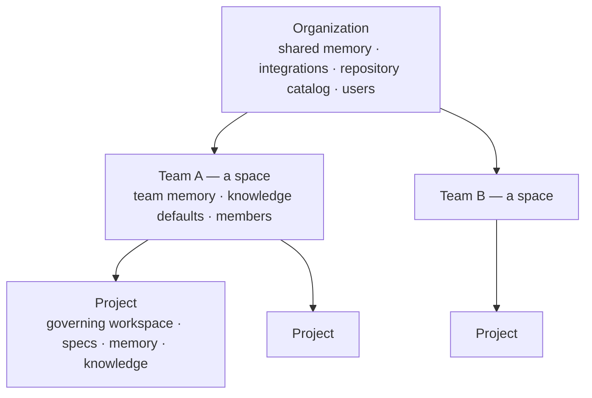

# Organization, teams and access

Spaces follows the AIDLC model of **spaces**: one shared organization, and
inside it teams that each own their own projects, memory and knowledge, so
several teams can work on one installation without colliding.

| Layer | Shared with | Holds |
|---|---|---|
| **Organization** | every team | Organization memory (principles, policies, standards), OAuth integrations, the GitHub repository catalog, user accounts |
| **Team** (space) | its members | Projects, team memory, default knowledge scope, members and roles, invites |
| **Project** | the team | Governing workspace, features and artifacts, project memory, imported knowledge, repositories |

Agents receive the three memory layers in that order in every stage's
context: organization first, then the team's, then the project's. The board,
history and project list show only the active team's projects; a session
remembers which team is active and you switch teams from the switcher at the
top of the sidebar.

## Accounts and sign-in

- **Email and password** (argon2id hashing) or **Continue with GitHub** (uses
  the GitHub OAuth app you configured for integrations; the token is used once
  for identity and never stored).
- Sessions are HttpOnly cookies valid for 30 days; only a hash of the token is
  stored.
- The **first account** created becomes the owner of the default team and
  adopts every existing project.
- After that, **registration is by invitation** unless `OPEN_REGISTRATION=1`.
- `AUTH_DISABLED=1` turns authentication off for single-user local use.

## Roles

| Role | Can |
|---|---|
| **owner** | Everything, including making other owners. A team always keeps at least one owner. |
| **admin** | Manage members, roles (except owner), invites, team name, team knowledge scope; everything a member can |
| **member** | Create and run projects, edit team memory, use the assistant's actions |
| **viewer** | Read everything and chat with the assistant; no changes |

Project-level authorization is by team membership: a project belongs to one
team, and only that team's members can read or act on it.

## Invites

Owners and admins invite by email and role. The server returns a link
(`/invite/<token>`) valid for 14 days and bound to that email; share it however
you like — no mail server is needed. Opening the link shows the team and role;
the invitee signs in or registers with the invited address (or with GitHub) and
joins immediately. Pending invites can be revoked.

## Organization and team memory

- **Organization memory** (sidebar → Memory) is edited by owners
  and admins and applies to every team: engineering principles, security
  policies, architecture standards, definitions of done.
- **Team memory** (sidebar → People → Memory) is edited by members and applies
  to the team's projects: conventions, reviewer preferences, rollout rules.
- **Project memory** (Memory tab) stays with the project, together with the
  auto-summary composed from its repositories.

Team-level **knowledge defaults** (which integrations and repositories a team's
agents may query) use the same shape as a project's knowledge scope
(`PUT /api/teams/:id/knowledge`) and are the fallback for projects without
their own scope.

## The team page

**People** in the sidebar opens the active team's page at
`/teams/<slug>`. Its overview shows members, active and archived projects
(codes open the project pages) and the team memory. Owners and admins rename
the team, change roles, create invite links and set the knowledge defaults
that new projects inherit; every member can edit team memory, and anyone can
leave from the Members section.

## The organization page

**Organization** in the sidebar opens `/organization`; Knowledge base,
Memory, Integrations, Models and Promotions are its sections, each one a
sidebar entry. It gathers everything shared across teams: the organization
name and memory, the knowledge base (imports and search), promotion proposals
from projects with approve and reject, and your teams with a way to start a
new one. Owners and admins of any team edit; everyone reads.
