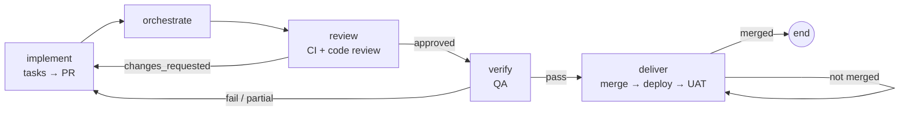

# Pipelines and stages

A run executes a **pipeline template**: an ordered list of steps, each bound to
a stage, with optional role persona, per-step model and thinking level, review
harness, human gate and `onComplete` branch rules.

## Stages

| Stage | What it produces | Notes |
|---|---|---|
| `init` | `.specify/` workspace | Deterministic during onboarding |
| `research` | `.aidlc/research/brief.md` | Before specifying: suggests, clones and learns the repositories the feature needs, loads organization knowledge and repository briefs, then an agent explores and writes the brief (repositories to change, patterns to reuse, standards, risks, open questions). `specify` reads it first |
| `specify` | `spec.md` with acceptance scenarios | Requires a feature description |
| `clarify` | Clarified spec | May pause with a question |
| `constitution` | `.specify/memory/constitution.md` | Requires constitution text |
| `plan` | `plan.md`, research, data model, contracts | Includes `## Repositories` |
| `tasks` | `tasks.md` | Ends with a per-repo `## Delivery` group |
| `testplan` | `test-plan.md` | |
| `parallelize` | `parallel-workstreams.md` | Machine-readable workstreams with `### Repository` |
| `analyze`, `checklist` | Analysis / checklist artifacts | |
| `implement` | Code changes on the feature branch | Opens or updates the PR |
| `orchestrate` | `merge-orchestrator.md` | Reconciles workstream branches |
| `review` | `code-review.md`, posted on the PR | `APPROVED` or `CHANGES_REQUESTED` |
| `verify` | `verification-report.md` | Actually runs the tests |
| `deliver` | `delivery-status.md`, `delivery-report.md` | Review → merge → deploy → UAT |
| `taskstoissues` | Issues created from tasks | |

## Gates and loops

- **Review harness** (`review: true`) has a second agent critique the stage output.
  When a code review records `Code Review Status: CHANGES_REQUESTED`, the run
  does not stop to ask: it goes straight back to implement with the findings,
  told to make the changes and update `tasks.md` to match. That happens at most
  twice in one run; after that the review comes to you rather than looping
  again. The review is posted on the feature's pull request either way, even
  when publishing the branch failed.
- **Human gate** (`humanGate: true`) pauses the run for approval, with three
  ways out: approve it as it stands, approve with notes that are applied to the
  stage before it continues, or describe the changes you want and send it back
  for another pass. Autonomous mode on the project auto-approves gates.
- **Clarification pauses** happen when the agent asks a question; answer in the
  run panel (or *Continue* if nothing was really asked).
- **Branch rules** (`onComplete.branch`) evaluate variables after a step:
  `verification_status` (`pass|fail|partial`), `code_review_status`
  (`approved|changes_requested`), `delivery_status` (`merged|partial|blocked`),
  `verification_near_pass` (`true` when a short verification is close enough to
  accept), `iteration`. A step a loop jumped back to continues with its
  successor in the template. `goto` jumps to another step id or `end`; `maxIterations` caps loops.

The feature template's implementation harness:

## Responsibility context

For mapped stages, the pipeline injects a project responsibility contact as
advisory context: Product Owner (specify/review), Lead Engineer
(plan/implement), Designer (design), QA (verify), and Release Manager
(deliver). Explicit assignments are preferred over the labeled Owner fallback;
an unresolved project asks for repair instead of selecting a person. This
context does not modify the template's human gates or team-role authorization.

## Board lanes

Backlog → Initialized → Specified → Planned → Tasked → Implementing →
Releasing → Done. A card's lane follows what the project has produced:

- **Implementing** covers the test plan, workstream split, implement,
  orchestrate, **code review** and **QA (verify)**, in that order: review comes
  before QA, or alongside it, never after release.
- **Releasing** starts once the code review approved the feature and
  verification passed, or a person accepted it. What is left is delivery:
  merge, deploy, UAT.
- **Done** means delivery reported `Delivery Status: MERGED`.

A run in progress places its card by the stage it is on. Dropping a card on a
lane runs the next step that leads there: test plan, workstream split,
implement, review or verify on Implementing; `accept` or `deliver` on
Releasing. Done takes no drop: it is a result.

### Implement is a loop

Running implement from the board or the next-step banner does not stop after
one pass. It runs implement, then the code review, and goes back to implement
while the review requests changes; then QA, and goes back to implement until
verification passes or comes close enough to accept (more than 95% of
criteria met, nothing critical open). There are no approval gates inside the
loop. A re-run works only on what the review or the verification report
flagged, and implement runs at most four times; after that the loop stops and
the board recommends the next step (review, verify, accept or implement
again).

Outside the loop, the next step follows the same order: implement until the
implementation tasks are done (the `## Delivery` tasks in `tasks.md` belong to
deliver and do not count), then review, then verify; a review that requested
changes leads back to implement, and to review again once `tasks.md` records
the fixes.

## Intents

In the interface these are **intents**; underneath they are Spec Kit features,
numbered directories under `specs/` (`001-login`, `002-billing`) with their own
spec, plan, tasks, reviews, verification and delivery record. The **current
intent** (the active one, else the newest) is what the board, lanes, next step
and runs work on; earlier intents are history. Their record (statuses,
documents and every change) lives in the database, with the files as the
agents' working copy. See **[Intents](intents.md)** for the record, scopes,
the intent viewer and history.

The project page lists every intent under **Overview → Intents**, newest first,
with its scope, status (specified → planned → tasked → implementing → verified
or accepted → delivered), review and verification outcome. Clicking a title
opens the intent viewer.

**＋ New intent** asks what the intent is and its scope (Auto lets the agent
decide), then runs `specify`, which opens the next numbered directory. When the
current intent isn't delivered, accepted or verified, Spaces asks first: the
unfinished intent stays in the list and the project moves on. A delivered
project's next step is **Start a new intent**.

### Continuing, renaming or deleting an intent

Each intent in the list has its own actions:

- **Continue** (earlier, undelivered intents) makes it the active intent: the
  board, lanes, next step, stage reports and runs work on it instead of the
  newest. Each repository switches to the intent's branch (named like its
  directory, `001-login`) when that branch exists and the checkout has no
  uncommitted changes; the others are listed as left alone.
- **Rename** rewrites the spec's title; the directory and branch keep their
  names.
- **Delete** (intents not delivered) removes the intent's directory and marks
  its record deleted, kept with its history. Git branches and pull requests on
  GitHub are left as they are, and a copy on another branch never brings it
  back. Delivered intents stay as history and can't be deleted.

Continue and Delete wait while a run is queued, running or waiting at a gate.

### Starting a new intent refreshes the project

Before `specify` opens a feature after an earlier one, the run:

1. **Pulls the latest code.** Each GitHub repository fetches and fast-forwards
   its default branch, leaving the previous feature's branch, so the new feature
   starts from current code. A checkout with uncommitted changes, or a default
   branch that diverged from origin, is left alone and the log says why.
2. **Learns what changed.** Repositories whose code moved are inventoried and
   briefed again by an agent, as during onboarding.
3. **Rebuilds project memory**, including a feature history: every earlier
   feature with its status and review and verification outcome.
4. **Refreshes the run's shared context**, so the spec and plan are written
   against the updated memory, organization knowledge and lessons.

The first feature skips this; onboarding has just learned the code.

## Accepting a partial verification

Verification reports `PASS`, `PARTIAL` or `FAIL`, and only a pass finishes a
feature on its own. Work often ends at partial for reasons that are nobody's
fault — a browser suite that cannot run on this machine, a requirement deferred
on purpose — so the person responsible can accept it instead: drag the card
onto **Releasing**, or press **Accept and finish** in the project's QA tab.

Accepting records `acceptance.md` beside the verification report with who
accepted it, the verification status at that moment and the reason given. The
feature moves to Releasing once its code review has approved it (otherwise
review is the next step), and deliver keeps its own approvals for merging and
deploying. Withdrawing the acceptance puts
the feature back where its verification left it.

When verification came close, **Accept and finish** is the recommended next
step instead of another verify run: more than 95% of acceptance criteria met
and no critical issues open. Verify writes both numbers under its status line
(`Acceptance Criteria Met: 48/50`, `Critical Issues Open: 0`); older reports
are read from the requirement traceability table, where any failing row or
unsatisfied test case marked critical, blocker or P0 counts as critical.
Accepting is still a person's decision and still asks why.

## Development-environment setup

Before `implement`, `orchestrate`, `review` and `verify` (and before parallel
sub-agents), every registered checkout is made ready for development: an agent
reads the README, manifests and CI config, installs dependencies, prepares
`.env` from its example, runs the build, tests and linter once, and records the
working commands and test baseline in `.aidlc/dev-setup.md` (local-only). Later
stages read that file; the step is skipped while a recent READY/PARTIAL record
exists.

## Parallel workstreams

`parallelize` groups tasks into workstreams. **Run implementation agents**
executes them with one sub-agent each, honouring `### Dependencies` (waves) and
`### Repository` (checkout). For GitHub-hosted repos each workstream runs in an
isolated git worktree on its own branch and gets its own PR, stacked on a
dependency's branch when one is named. `orchestrate` merges the branches back
into the feature branch.

## Reruns keep context

Re-running or resuming from a stage reopens the previous attempt's agent
session and seeds the cross-stage handoff thread from what earlier stages
recorded, so the restarted stage does not begin from scratch.

See the [template reference](../reference/templates.md) for the shipped
templates and the YAML schema.
