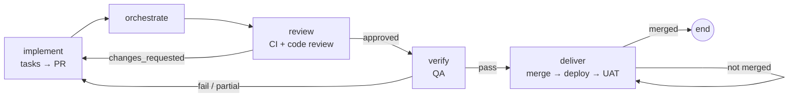

# Pipelines and stages

A run executes a **pipeline template**: an ordered list of steps, each bound to
a stage, with optional role persona, per-step model and thinking level, review
harness, human gate and `onComplete` branch rules.

## Stages

| Stage | What it produces | Notes |
|---|---|---|
| `init` | `.specify/` workspace | Deterministic during onboarding |
| `research` | `.aidlc/research/brief.md` | Before specifying: suggests, clones and learns the repositories the feature needs, loads organization knowledge and repository briefs, then an agent explores and writes the brief (repositories to change, patterns to reuse, standards, risks, open questions). `specify` reads it first |
| `specify` | `spec.md` with acceptance scenarios | Requires a feature description |
| `clarify` | Clarified spec | May pause with a question |
| `constitution` | `.specify/memory/constitution.md` | Requires constitution text |
| `plan` | `plan.md`, research, data model, contracts | Includes `## Repositories` |
| `tasks` | `tasks.md` | Ends with a per-repo `## Delivery` group |
| `testplan` | `test-plan.md` | |
| `parallelize` | `parallel-workstreams.md` | Machine-readable workstreams with `### Repository` |
| `analyze`, `checklist` | Analysis / checklist artifacts | |
| `implement` | Code changes on the feature branch | Opens or updates the PR |
| `orchestrate` | `merge-orchestrator.md` | Reconciles workstream branches |
| `review` | `code-review.md`, posted on the PR | `APPROVED` or `CHANGES_REQUESTED` |
| `verify` | `verification-report.md` | Actually runs the tests |
| `deliver` | `delivery-status.md`, `delivery-report.md` | Review → merge → deploy → UAT |
| `taskstoissues` | Issues created from tasks | |

## Gates and loops

- **Review harness** (`review: true`) has a second agent critique the stage output.
- **Human gate** (`humanGate: true`) pauses the run for approval. Autonomous
  mode on the project auto-approves gates.
- **Clarification pauses** happen when the agent asks a question; answer in the
  run panel (or *Continue* if nothing was really asked).
- **Branch rules** (`onComplete.branch`) evaluate variables after a step:
  `verification_status` (`pass|fail|partial`), `code_review_status`
  (`approved|changes_requested`), `delivery_status` (`merged|partial|blocked`),
  `iteration`. `goto` jumps to another step id or `end`; `maxIterations` caps loops.

The feature template's implementation harness:

## Development-environment setup

Before `implement`, `orchestrate`, `review` and `verify` (and before parallel
sub-agents), every registered checkout is made ready for development: an agent
reads the README, manifests and CI config, installs dependencies, prepares
`.env` from its example, runs the build, tests and linter once, and records the
working commands and test baseline in `.aidlc/dev-setup.md` (local-only). Later
stages read that file; the step is skipped while a recent READY/PARTIAL record
exists.

## Parallel workstreams

`parallelize` groups tasks into workstreams. **Run implementation agents**
executes them with one sub-agent each, honouring `### Dependencies` (waves) and
`### Repository` (checkout). For GitHub-hosted repos each workstream runs in an
isolated git worktree on its own branch and gets its own PR, stacked on a
dependency's branch when one is named. `orchestrate` merges the branches back
into the feature branch.

## Reruns keep context

Re-running or resuming from a stage reopens the previous attempt's agent
session and seeds the cross-stage handoff thread from what earlier stages
recorded, so the restarted stage does not begin from scratch.

See the [template reference](../reference/templates.md) for the shipped
templates and the YAML schema.
