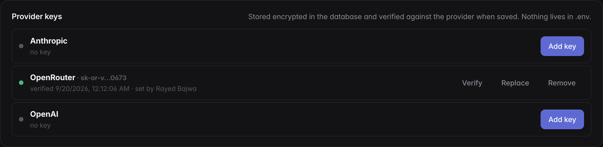

# Getting started

## Prerequisites

- [Bun](https://bun.sh) 1.4+
- Docker (for Postgres)
- A Chromium for the agents' browser tools: `make setup` (or `bun run
  setup:browsers`) runs `playwright install chromium`; the Docker image
  already contains it
- An Anthropic API key
- Optional: OAuth apps for GitHub, Atlassian (Jira + Confluence), Linear, Slack

## Install and run

```bash
git clone https://github.com/rayedbajwa/spaces.git
cd spaces
cp .env.example .env
# Edit .env — set ENCRYPTION_KEY (openssl rand -base64 48); add provider keys
#   in the app under Organization → Models afterwards
bun install
bun run db:up            # Postgres in Docker
bun run db:migrate       # idempotent schema (the server also applies it at boot)
bun run web              # web UI + API on http://localhost:3000
bun run supervisor       # in a second terminal: one worker per active project
```

`bun run worker` starts a single shared worker instead of the supervisor; it
runs jobs from different projects concurrently while honouring each project's
concurrency limit.

### With the Makefile

```bash
make setup          # .env (fresh ENCRYPTION_KEY), bun install, Postgres, schema, frontend build
make up             # Postgres + web server + supervisor in the background; logs in .run/
make status         # processes, live workers, queue depth
make logs           # tail server + supervisor logs
make restart        # restart server + supervisor (runs are re-queued or stay paused)
make e2e            # bring the stack up and run the e2e suite for every pipeline template
make e2e-one T=aidlc-feature
make e2e-canary     # the smallest template only
make docs           # strict MkDocs build
make down           # stop everything
```

`make help` lists all targets.

!!! note "Provider keys live in the app"
    Anthropic, OpenAI and OpenRouter keys are added under **Organization →
    Models**, stored encrypted and verified when saved. A key left in `.env`
    or the shell is ignored; the server logs a warning naming it at boot.

## Sign in and create your team

Open [http://localhost:3000](http://localhost:3000). With no accounts yet, the
sign-in screen offers **Create the first account**; that account becomes the
owner of the first organization and its default team, and adopts any existing
projects. Afterwards, registration is by invitation: open **People** in the
sidebar, invite teammates by email and role, and share the generated link.
Teammates can also **Continue with GitHub**. An account that registers without
an invite starts its own organization, which shares no keys, integrations,
knowledge or projects with yours. See
[Organizations, teams & access](concepts/organization-teams-and-access.md).

## Bring your model keys

!!! note "Required before the first project"
    **New project** stays disabled, and `POST /api/projects` answers `409`,
    until at least one provider key is stored. The Projects page shows a
    banner with a shortcut to **Models** until then.

Spaces routes across the model providers you already have accounts with; it
ships without any. Supported providers and where to create a key:

| Provider | Get a key | Notes |
|---|---|---|
| **Anthropic** | [console.anthropic.com → API keys](https://console.anthropic.com/settings/keys) | Claude models directly (`sk-ant-…`) |
| **OpenAI** | [platform.openai.com → API keys](https://platform.openai.com/api-keys) | GPT models directly; also serves knowledge-base embeddings (`sk-…`) |
| **OpenRouter** | [openrouter.ai → Keys](https://openrouter.ai/settings/keys) | One key for every vendor; OpenRouter routes each request itself (`sk-or-…`) |



1. Open the account menu → **Organization**, then **Models** (the account
   menu's *Models* row goes straight there).
2. Under **Provider keys**, press **Add key** for Anthropic, OpenAI or
   OpenRouter and paste the key. It is verified live and stored encrypted; a
   rejected key is not saved. One provider is enough.
3. Read the **Model routing** card: it shows which provider routes and what
   the small / medium / large tiers resolved to, with the reason. Adjust the
   **Policy** (cost / balanced / quality, provider order, premium models,
   pins) if you like. With OpenRouter, OpenRouter picks the model per request.

Keys take effect in every process within a second — no restart. See
[Configuration → Models](reference/configuration.md#models) for the details.

## Connect GitHub

Open **Organization → Integrations**, press **Set up app** on GitHub and
then **Create GitHub App**: confirm on GitHub, come back, press **Install on
GitHub**, pick repositories, and the connection is approved on the way back.
Once connected, every repository the account can see is indexed with its README use
case (the *repository catalog*), and the new-project wizard can autocomplete
repositories.

## Create a project

Click **New project** and walk through the wizard:

1. **Name and description.** You can also *Import from Jira / Linear*: pick a
   ticket, and it fills the name, description and first feature and is attached
   to the project as knowledge.
2. **Repositories (optional).** Specs and memory live in the project's
   *governing workspace*; code repositories can be added now (GitHub
   owner/name or local path) or left to onboarding and the plan.
3. **Integrations.** Optional.
4. **First feature.** Describe it and choose **Create + run AIDLC**.

Onboarding then runs while you watch: clone remote repos → initialise the Spec
Kit workspace → inventory and learn each repo → build project memory → suggest
repositories and work areas → set up the development environments. When it is
done you review the suggested repositories (Add & clone) and continue; the first
run starts in real checkouts. When nothing registered or in the catalog fits,
discovery proposes a **new repository** instead: a GitHub-safe name derived
from the project, private by default. **Create on GitHub & attach** creates it
through the connected account, clones it and makes it the primary repo, or
**Create manually** opens GitHub's new-repository page prefilled so you can
attach it afterwards.

## Follow a run

Open the project card. The run panel streams the agent's output live; the tabs
show specs, test plan, implementation workstreams, QA, the assistant, shared
context, memory and promotions. Paused runs show an answer box (**Approve and
continue** for review gates, **Continue** or a typed answer for clarifications).
Failed or interrupted runs offer **Rerun from &lt;stage&gt;**.

## Next steps

- Understand the [pipeline templates](reference/templates.md) and pick one per
  kind of work (feature, bugfix, refactor, infra, …).
- Scope the project's [knowledge sources](concepts/integrations-and-knowledge.md)
  in the Context tab.
- Read how [delivery](concepts/delivery.md) drives PRs, review, merge and UAT.
