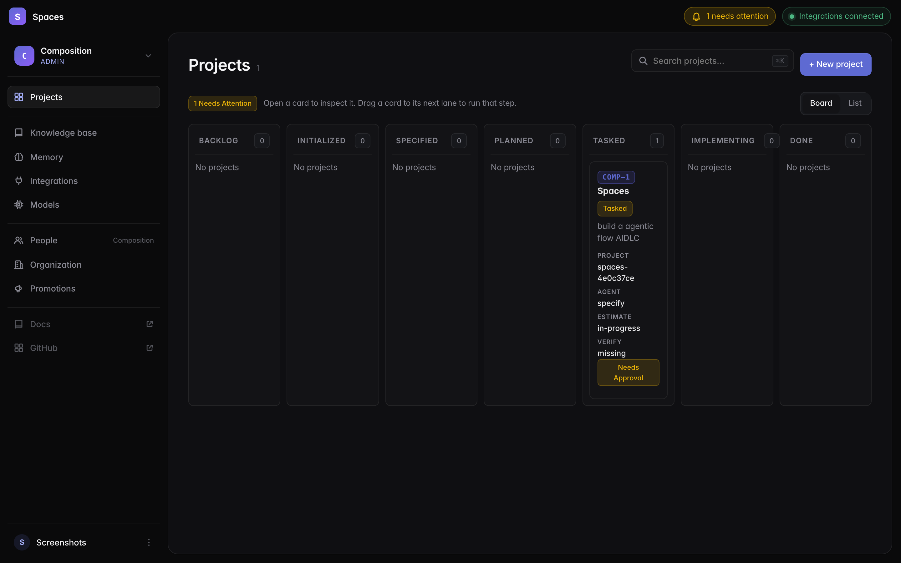
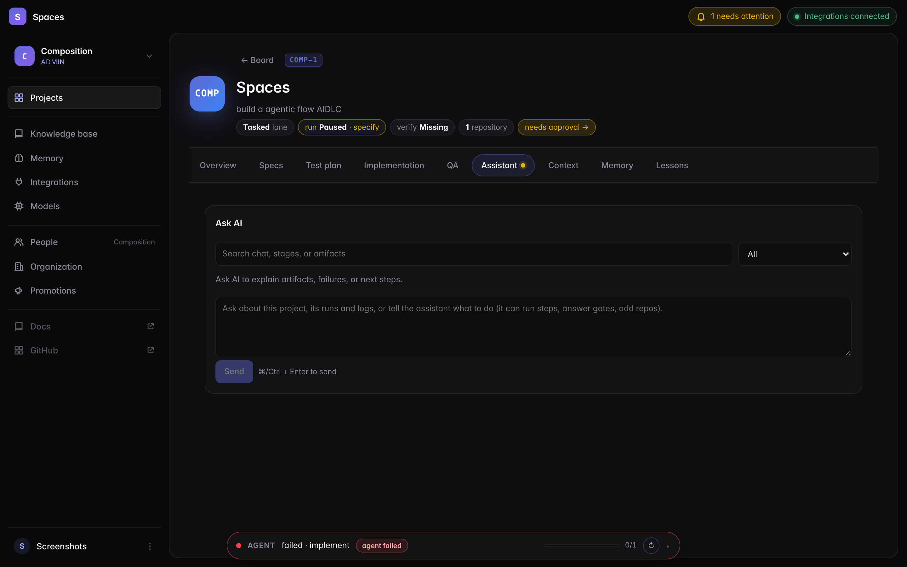
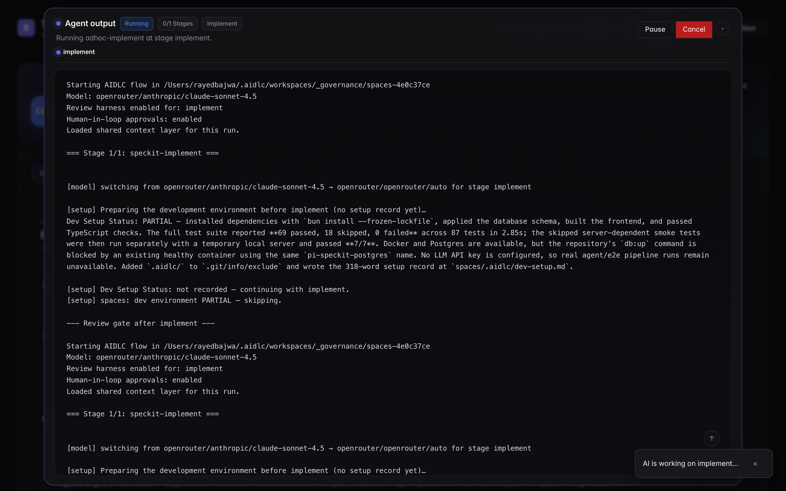

# Spaces

**The AI software factory for your team. Specs go in, reviewed and tested pull requests come out.**

**Try it at [spacesos.dev](https://spacesos.dev)**

Spaces is a source-available software factory. Every feature moves down an
assembly line of specialised agents — `research → specify → plan → tasks →
implement → review → verify → deliver` — that know your codebase, your team's
conventions and the tickets behind the work. Humans sign off at the gates that
matter; the factory does the rest.

| | |
|---|---|
| **Raw material in** | A Jira or Linear ticket, a Confluence page, a GitHub issue or an idea in plain words |
| **The line** | One agent per station, human gates after specify, plan, tasks, implement and verify, and loops that fix until green, review until approved and deliver until merged |
| **Finished goods out** | A branch and a Conventional-Commits PR per workstream: CI green, code reviewed, QA done, spec committed with the code, then merged and deployed |

A web UI shows the whole floor — a board where every card is a feature on the
line, live agent output and the artifact each station leaves — with
integrations for GitHub, Jira, Confluence, Linear and Slack set up in the app.

Stages run on GitHub's [Spec Kit](https://github.com/github/spec-kit) (through
[`@the-agency/pi-spec-kit`](https://www.npmjs.com/package/@the-agency/pi-spec-kit))
and the [Pi Coding Agent SDK](https://www.npmjs.com/package/@earendil-works/pi-coding-agent).
The pipeline follows the ideas of AWS's
[AI-Driven Development Life Cycle](https://github.com/awslabs/aidlc-workflows)
(AIDLC), not its workflow files.

## What it does

-   **Pipelines as templates**

    Declarative YAML: stages, roles, per-stage models, human gates, branch
    conditions and loops (fix-until-green, review-until-approved,
    deliver-until-merged). See [Pipelines & stages](concepts/pipelines-and-stages.md).

-   **A governing workspace per project**

    Specs, plans, tasks, reports and memory live in a dedicated local git repo;
    code repositories are cloned on demand from your GitHub catalog when the
    plan names them. See [Projects & governing workspace](concepts/projects-and-workspaces.md).

-   **Agents that act, not advise**

    Agents set up the dev environment, run builds and tests, fix lint and CI,
    open pull requests, review code and ask for approval only before merging or
    deploying. See [Agents, workers & context](concepts/agents-and-workers.md).

-   **Integrations as knowledge**

    Jira, Confluence, Linear and GitHub are exposed to agents as scoped tools,
    tickets can be imported as the starting point of a feature, and whole
    spaces, projects, initiatives, repositories, web pages and notes can be
    imported into an organization knowledge base with semantic search.
    See [Integrations as knowledge](concepts/integrations-and-knowledge.md).

-   **Self-serve setup, isolated per organization**

    Provider keys, OAuth app credentials, model routing, memory, the knowledge
    base and teams are managed on the organization page; each team has a page
    for members, invites, memory and knowledge defaults. An organization is the
    tenant boundary: two of them share nothing. See
    [Organizations, teams & access](concepts/organization-teams-and-access.md).

-   **Automatic model routing**

    No model is named anywhere: for the provider in use the catalog is scored
    by cost and speed into small / medium / large tiers, tuned by an
    organization policy; with OpenRouter, OpenRouter routes each request. See
    [Configuration](reference/configuration.md#models-bring-your-own-key).

-   **Research before specify, changes committed with the code**

    A `research` stage clones and learns the repositories a feature needs and
    loads the knowledge base before anything is specified; each implementation
    repository then carries `specs/<NNN-intent>/` with its change, tasks and
    delta spec on the same pull request. See
    [Pipelines & stages](concepts/pipelines-and-stages.md) and
    [Delivery](concepts/delivery.md).

-   **Delivery, end to end**

    Every workstream gets a branch and a Conventional-Commits PR (stacked when
    dependent); the `review` and `deliver` stages drive CI, review, merge,
    deploy and UAT. See [Delivery](concepts/delivery.md).

-   **Intents, recorded**

    Each piece of work (bug fix, feature, MVP…) is an intent with a scope, its
    documents and every status change kept in the database; open one to page
    through everything it produced and its history. See [Intents](concepts/intents.md).

-   **Secrets and personal data kept from models**

    Keys, passwords, connection strings, emails, phone numbers and card
    numbers become tokens before anything reaches a model, and real values are
    put back only in the commands and files agents write. See
    [Data guardrails](concepts/data-guardrails.md).

-   **Logs you can follow**

    Every tool call an agent (or sub-agent) makes is a line in the log,
    stamped with the time and the agent's name. See
    [Agents, workers & context](concepts/agents-and-workers.md#what-the-log-shows).

-   **Resilient runs**

    Worker restarts re-queue or pause runs instead of failing them, transient
    provider errors retry, and reruns resume the previous agent session.
    See [Running & troubleshooting](operations/troubleshooting.md).

## Who is this for?

- **Engineering leads** who want AI to run the boilerplate steps of feature
  delivery while keeping review gates where they matter.
- **Solo developers and small teams** who want an agentic workflow that spans
  several projects and repositories and remembers prior context.
- **Anyone experimenting with agentic SDLC patterns** who wants a runnable
  reference implementation backed by Postgres, a job queue and a project board.

Spaces is **not** a code generator you fire and forget. It is a production line
with inspection points: explicit gates between stations, and an artifact you
can read, approve or send back at each one.

Ready? Continue with [Getting started](getting-started.md).
