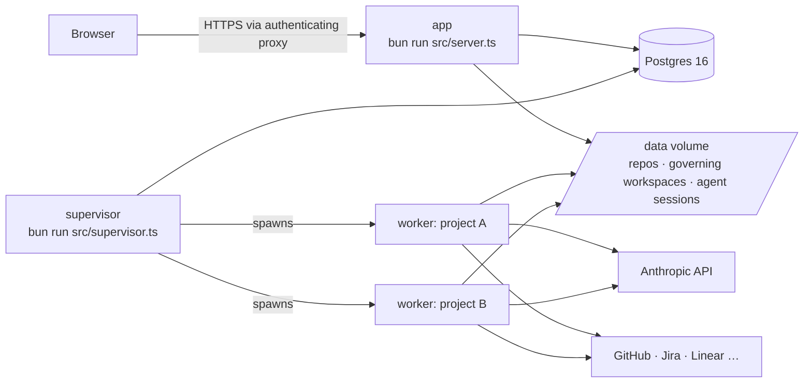

# Deploying to the cloud

Spaces is three long-running pieces plus Postgres:



| Component | Role | Scale |
|---|---|---|
| **app** | Web UI + JSON API, SSE streams, OAuth callbacks, applies the DB schema at boot | 1 instance (no sticky sessions needed) |
| **supervisor** (or **worker**) | Executes runs; the supervisor spawns one worker per active project and reaps idle ones | 1 supervisor; `SUPERVISOR_MAX_WORKERS` bounds memory (~300–500 MB per worker) |
| **Postgres** | Projects, runs, events, job queue, sealed tokens, worker heartbeats | Managed service recommended |
| **/data volume** | Cloned repositories, governing workspaces (specs, memory, reports), Pi agent sessions | Persistent disk shared by app and workers |

!!! danger "Authentication"
    The web UI has **no built-in authentication**. Never expose port 3000
    directly. Put an authenticating reverse proxy in front (Cloudflare
    Access, Tailscale, Google IAP, Caddy/nginx with OIDC or basic auth) and
    keep the app and workers on a private network. See `SECURITY.md`.

## The container image

The repository ships a multi-stage `Dockerfile` (Bun 1.4 on Alpine) that
bundles the frontend and runs as the non-root `bun` user. The image includes
`git` (agents clone, branch, commit and push), sets `HOME=/data/home` and
`AIDLC_WORKSPACE_ROOT=/data/aidlc/workspaces`, and declares `/data` as a
volume. The same image runs every role:

```bash
docker build -t spaces:latest .
docker run … spaces:latest                              # app (default CMD)
docker run … spaces:latest bun run src/supervisor.ts    # per-project workers
docker run … spaces:latest bun run src/worker.ts        # single shared worker
```

## Option A — single VM with Docker Compose

The quickest production-ish setup: one VM (4 vCPU / 8 GB is comfortable for
3–4 concurrent project workers), Docker, and the shipped compose file.

```bash
git clone https://github.com/rayedbajwa/spaces.git && cd spaces
cp .env.example .env            # set ENCRYPTION_KEY, ANTHROPIC_API_KEY, OAuth client ids/secrets
docker compose --profile full up -d --build
docker compose logs -f app supervisor
```

This starts Postgres (volume `pi-speckit-pgdata`), the app on port 3000 and the
supervisor, all sharing the `spaces-data` volume mounted at `/data`. Put Caddy,
nginx or Cloudflare Tunnel in front for TLS and authentication, and point the
OAuth apps' callback URLs at `https://<your-host>/api/oauth/<provider>/callback`.

Back up two things: the Postgres volume and `/data` (or push the governing
workspaces to a git remote of your own).

## Option B — managed containers (AWS ECS/Fargate, Google Cloud Run, Azure Container Apps)

- **Database:** a managed Postgres 16 (RDS, Cloud SQL, Azure Database). Set
  `DATABASE_URL`. The app applies the schema at boot; you can also run
  `bun run db:migrate` as a one-off task.
- **app service:** the image with the default command, 1 task, 1 vCPU / 2 GB,
  health check `GET /health`, behind a load balancer that terminates TLS and
  enforces authentication (ALB + Cognito/OIDC, IAP, Front Door). SSE needs
  idle timeouts of a few minutes or more on the proxy.
- **supervisor service:** the image with `bun run src/supervisor.ts`, 1 task,
  2 vCPU / 4–8 GB depending on `SUPERVISOR_MAX_WORKERS`. Workers are child
  processes, so size the task for the fleet rather than one worker. On
  platforms that scale to zero or kill idle containers (Cloud Run jobs, Fargate
  Spot) prefer a shared `bun run src/worker.ts` service that stays up; runs
  interrupted by a stop are re-queued automatically.
- **Storage:** mount a persistent file system at `/data` on both services
  (EFS on ECS, Filestore on Cloud Run/GKE, Azure Files). Cloned repositories
  and governing workspaces must be visible to the app (artifact browsing,
  plan-repo matching) and to the workers (runs).
- **Secrets:** inject `ENCRYPTION_KEY`, `ANTHROPIC_API_KEY` and the OAuth
  client secrets from the platform's secret manager; never bake them into the
  image. Rotating `ENCRYPTION_KEY` invalidates every stored OAuth token.
- **Egress:** workers need HTTPS to `api.anthropic.com`, `api.github.com`,
  `github.com`, Atlassian and Linear APIs, and the package registries the
  projects use (dev-environment setup installs dependencies).

## Option C — Kubernetes

One `Deployment` per role (`app`, `supervisor`), a `Service` + authenticated
`Ingress` for the app only, a `PersistentVolumeClaim` with `ReadWriteMany`
mounted at `/data` on both, and an external or operator-managed Postgres.
Give the supervisor pod a memory request sized for `SUPERVISOR_MAX_WORKERS`
and set `terminationGracePeriodSeconds` to ~60 s so workers can re-queue or
pause their runs cleanly on rollout.

## Option D — Railway, Fly.io, Render

Create two services from the same repository (Dockerfile build): **app** with
the default command and a public domain behind an auth proxy, **supervisor**
with the start command `bun run src/supervisor.ts` and no public port. Add a
Postgres plugin/add-on and a persistent volume mounted at `/data` on both
services (on Railway, one volume can be attached to one service — attach it to
the supervisor and give the app its own smaller volume, or run app and
supervisor as one service with a process manager). Set the environment
variables from `.env.example` as service secrets.

## Environment for cloud deployments

| Variable | Recommendation |
|---|---|
| `DATABASE_URL` | Managed Postgres, TLS (`?sslmode=require`) |
| `ENCRYPTION_KEY` | From a secret manager; back it up with the database |
| `ANTHROPIC_API_KEY` | From a secret manager; verified at boot |
| `PORT` | `3000` (or what the platform injects) |
| `AIDLC_WORKSPACE_ROOT` | `/data/aidlc/workspaces` (image default) |
| `AIDLC_GOVERNANCE_ROOT` | leave default (`<workspace root>/_governance`) |
| `SUPERVISOR_MAX_WORKERS` | 3–4 per 8 GB |
| `WORKER_IDLE_EXIT_SECONDS` | `300`; raise if cold-starting workers is slow |
| `*_CLIENT_ID` / `*_CLIENT_SECRET` | OAuth apps with callbacks on the public host |

## Operations

- **Zero-downtime-ish restarts:** stop the supervisor first (SIGTERM). Running
  runs are re-queued from their stage and paused runs stay paused; the new
  supervisor picks them up. Then restart the app.
- **Health:** `GET /health` on the app; `GET /api/workers` lists live workers
  with heartbeats. Alert when a project has queued jobs and no hot/warm worker
  for more than a few minutes.
- **Logs:** JSON lines on stdout from every process (`mod` field names the
  module); ship them to your log platform.
- **Backups:** Postgres (runs, events, tokens) and `/data` (repos are
  re-clonable; governing workspaces hold specs, reports and memory — back those
  up or push them to a git remote).
- **Upgrades:** pull the new image; the app applies idempotent schema changes
  at boot, so rolling the app first, then the supervisor, is safe.
